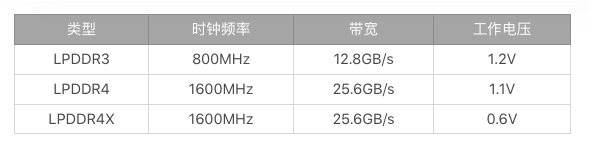
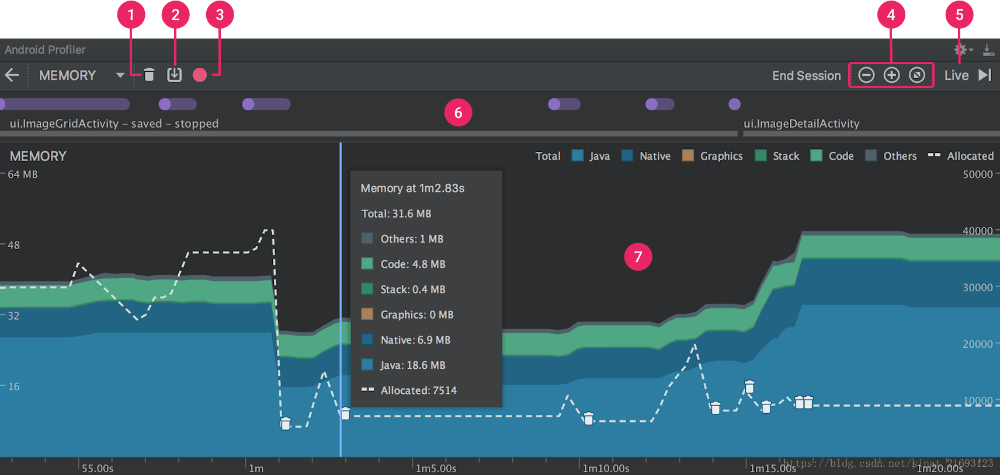

### 内存优化

#### 一、关于手机运行内存
手机运行内存 （RAM） 相当于 PC 中的内存，但是由于要考虑体积和功耗，手机不能使用手机上的 DDR 内存，而是采用 LPDDR RAM，即低功耗双倍数速率内存。

以 LPDDR4 为例，带宽 = 时钟频率 X 内存总线位数 / 8 ,即 1600 * 64 / 8 12.8 GB/s, 因为 DDR 内存是双倍速率，所以最后的带宽是 12.8* 2 = 25.6GB/s 。
手机内存不能当作是一个孤立的概念，应该和操作系统，应用生态等因素有关系，如 同样是 1GB 内存，Android 9.0 肯定要不 Android 4.0 更流畅，同时 IOS 要比 Android更好一些。



#### 二、由内存产生的问题
##### 异常

通常由内存造成的第一个问题就是异常，包括 OOM，内存分配失败，整体内存不足导致应用被杀死，设备重启。
卡顿

Java内存不足会导致频繁GC，这个问题在Dalvik虚拟机会更加明显。而ART虚拟机在内存管理跟回收策略上都做大量优化，内存分配和GC效率相比提升了5～10倍。如果想具体测试GC的性能，例如暂停挂起时间、总耗时、GC吞吐量，我们可以通过发送SIGQUIT信号获得ANR日志。
```
adb shell kill -S QUIT PID
adb pull /data/anr/traces.txt
```

它包含一些ANR转储信息以及GC的详细性能信息。
```
sticky concurrent mark sweep paused:    Sum: 5.491ms 99% C.I. 1.464ms-2.133ms Avg: 1.830ms Max: 2.133ms     // GC 暂停时间
Total time spent in GC: 502.251ms     // GC 总耗时
Mean GC size throughput: 92MB/s       // GC 吞吐量
Mean GC object throughput: 1.54702e+06 objects/s 

```

除了频繁GC 造成的卡顿之外，物理内存不足还会触发 low memory killer 机制，系统负载过高，是造成卡顿的另一个原因。
#### 三、关于内存使用的误区
#####  内存占用越少越好
应该是，内存充足时，可以多用一些，提高性能，内存不足是，及时释放。

关于 Android Bitmap 内存分配策略：

•  Android 3.0 之前，Bitmap 对象放到 java 堆，像素数据放到 Nativie 内存中。但是如果不手动调用 recycle，Bitmap Natvie 内存的回收完全依赖 finalize 函数回调。

• Android 3.0 ~ Android 7.0 将 Bitmap 对象和像素数据同一放到了 Java 堆中，这样，就算不调用 recycle，Bitmap 内存对象也会随着对象以前回收。但是，Bitmap 非常消耗内存，并且不同的手机系统，都会规定 Java 堆的大小，如 Mate 20 ，最大的 Java 堆限制也才到 512 MB。同时，Bitmpa 放到 Java 堆里面，也会引起大量的 GC 。

• Android 8.0 通过使用 NativeAllocationRegistry 可以将Bitmap 内存放到 Native 中，可以做到和对象一起释放。Android 8.0 还新增了硬件位图 Hardware Bitmap ,可以减少图片内存并提高绘制效率。

##### Native 内存不用管
即使放到 Native 里面，还会触发 lmk。

在 Android 5.0 ~ Android 7.0 ，也可以将图片放到 Native 上，但是可能会复杂一点。

1、通过直接调用 libandroid_runtime.so 中 Bitmap 的构造函数，得到一张空的 Bitmap 对象，这个内存是放到 Native 堆中的。

但是不同版本实现有点差异，需要适配。

2、通过系统的方法，创建一个普通的 Java Bitmap

3、将 Java Bitmap 的内容绘制到之前申请的空的 Native Bitmap 中。

4、将申请的 Java Bitmap 释放，实现偷龙换凤。

```
// 步骤一：申请一张空的 Native Bitmap
Bitmap nativeBitmap = nativeCreateBitmap(dstWidth, dstHeight, nativeConfig, 22);
// 步骤二：申请一张普通的 Java Bitmap
Bitmap srcBitmap = BitmapFactory.decodeResource(res, id);
// 步骤三：使用 Java Bitmap 将内容绘制到 Native Bitmap 中
mNativeCanvas.setBitmap(nativeBitmap);
mNativeCanvas.drawBitmap(srcBitmap, mSrcRect, mDstRect, mPaint);
// 步骤四：释放 Java Bitmap 内存
srcBitmap.recycle();
srcBitmap = null；

```


#### 四 、内存使用的测量
##### 常用的命令：
```
adb shell dumpsys meminfo <package_name|pid> [-d]
```

##### Java 内存分配
通常有两个工具可以用来追踪 Java 堆内存的使用情况： Allocation Tracker 和 MAT.

Allocation Tracker 有三个缺点：

1、获取的信息过于分散，中间夹杂其他可能无用的信息

2、和 Tranceview 一样，无法做到自动化分析，需要手动开始/结束。

3、在 Allocation Tracking 的时候，不会对手机本身的运行产生过多的影响，但是在停止的时候，直到把数据 dump 之前，可能会把手机卡死，时间过长还可能会 anr。

我们可以自定义 Allocation Tracker 来监控 Java 内存，可以拓展成实时监控 Java 内存泄露。但是需要考虑兼容性问题比较多，在 Dalik 和 ART 中，Allocation Trcker 的开启方式：
```
//dalvik
bool demEnableAllocTracker()
//art
void setAllocTrackingEnabled()
```


#####  Native 内存分配

Google 内存分析建议用 AddressSanitize 来使用。但是支持不是很好。

Native 内存调试方面，有两个方法： Malloc 调试 和 Malloc 钩子。

Malloc 调试可以帮助我们调试 native 内存的一些问题，例如堆破坏，内存泄露，非法地址等。Android 8.0 之后支持在 非 root 的设备上做 native 内存调试，不过和 AddressSanitize 一样，需要通过 wrap.sh 包装。

```
adb shell setprop wrap.<APP> '"libc_debug_malloc_options=backtrace logwrapper" '
```
Malloc 钩子 是在 Android P 之后，Android 的 libc 支持拦截在程序执行期间发生的所有分配/释放调用，这样就可以构建自定义内存检测工具。
```
adb shell setprop wrp.<APP> '"LIBC_HOOKS_ENABLE=1"'
```

#### 五、Android Memory Profile 查看内存

概念：

Heap Dump:

Heap Dump 是指在某个时刻对一个 Java 进程所使用的内存情况的一次快照，也就是在某个时刻把  Java 进程的内存以某种格式持久化到了磁盘上。

##### 为什么要分析内存：

1、频繁的内存分配和回收会导致应用卡顿

2、内存泄露会导致系统性能下降，最严重可能导致被杀死。

Android Memory Profiler 提供的功能：

1、在时间轴中寻找可能导致性能问题的不良内存分配模式。

2、在 Java 堆中查看哪些对象正在长期使用内存，长时间的堆转储可以帮助识别内存泄露。

3、在正常和极端的用户交互过程中记录内存分配，以确定代码在短时间内分配太多对象或者分配泄露对象的位置。

Memory Profiler 预览：



按钮及功能介绍：

1、用于强制执行垃圾回收

2、用于捕获堆转储

3、记录内存分配情况（Android 7.1 及以下可用）

4、放大或者缩小时间线

5、跳转至实时按钮

6、Event 时间线，显示 Activity 状态，用户输入 Event 或者屏幕旋转 Event 等。

7、内存使用时间轴，会显示一下内容

• 图表，显示实时每个内存的占用

• 虚线，表分配对象数

• 每次垃圾回收，都有垃圾桶标识

Android Profile 内存的计算


这里的内存，不包括与系统或其他应用共享的页面。

这些统计的内存类别：

+ Java : 从 java 或者 kotlin 代码分配的对象内存
+ Native: 从 c 或者 c++ 代码分配的对象内存
+ Graphics: 图形缓冲区队列向屏幕显示像素所适用于的内存
+ Stack: 应用中原生堆栈和 Java 堆栈所使用的内存，通常和运行的线程数量有关。
+ Code: 代码和资源
+ Others: 不知道如何分类的
+ Allocated: 应用分配的对象数（不包括 c /c++）

捕获堆转储


堆转储显示在内存时间轴的下方，显示堆中所以类类型：

每一列表示的含义：

• Allocations: 堆中的分配数

• Native Size : 对象类型使用的原生内存总量（字节为单位）

• Shallow Size : 此对象类型，使用的 java 内存总量

• Retained Size : 为此类的所有实例保留的内存总大小

在左侧的菜单栏中，可以选择要检查哪一个堆：

• default heap : 默认的

• app heap: 应用在其中分配的内存主堆

• image heap : 系统启动映像

• zygote heap: 写时复制堆

左侧菜单栏可以选择按什么类别查看：

• Arrange by class :  根据类名分组

• Arrange by package ： 根据包分组

• Arrage by callstack : 按调用堆栈分组。

#### 六、Malloc 调试

包括两部分内容： Malloc 调试 和 使用 libc 回调跟踪本地内存

##### 1 、Malloc 调试
malloc 调试是一中调试 Native 内存的方法，可以帮助检测内存损坏，内存泄露以及内存释放后又重新使用等问题。

Malloc 调试方法在 Android N及以上和 Android N 以下版本使用方法不同。低版本上使用，因为 Malloc 自身的问题，不一定会有效。

###### 1.1  旧版本调试介绍。

可以使用的前提条件：

1、ROOT 

2、shell 可以使用 setprop 命令

当 malloc debug 设置为启用时，就可以替换调系统调用，可以替换的系统调用有：

• malloc

• free

• calloc

• realloc

• posix_memalign

• memallign

• malloc_usable_size

在 32 位系统上，有两个被弃用的系统调用，可以可以被 替换：

• pvalloc

• valloc

这个库，可以把检测到的错误记录到日志中。

Malloc Debug 控制

Malloc 调试可以通过 libc.debug.malloc 这个系统属性的数值来控制。

数值 1：

当这个模式启用的时候，会为所有的分配添加一个特殊的标头，包含分配的信息。

创建分配时回溯：

追踪每一个分配对象，这个选项会导致分配速度降低一个数量级，并且可能导致系统启动时超时。

追踪实时分配：

当前所有的实时分配都会被追踪，并且通过调用 get_malloc_leak_info 来检索。


数值 5：

这个模式不会添加标头，仅会修改分配的内容。


数值10：

启用后，此值将为所有分配创建一个特殊的标头，其中包含有关分配的信息。

该值将启用所有启用了值1以及其他选项的功能。


分配守卫

在返回的分配之前放置一个32字节的缓冲区（称为前卫）。此缓冲区填充有模式（0xaa）。另外，在返回分配的数据之后放置了一个32字节的缓冲区（称为后卫）。此缓冲区填充有模式（0xbb）。
释放分配后，将验证这两个防护措施均包含预期的模式。如果不是，则将错误消息打印到日志。

空闲内存跟踪

释放指针后，不要立即释放内存，而是将其添加到释放的分配列表中。除了被添加到列表中之外，整个分配都用值0xef填充，并且记录空闲时的回溯。与分配时的回溯一样，最多只能记录16帧。
当释放的分配列表达到100时，列表上最旧的分配将被删除并验证其是否仍包含模式0xef。如果整个分配未用此值填充，则将错误打印到日志。


日志泄漏
程序完成后，所有仍处于活动状态的分配将作为泄漏打印到日志中。这不是很有用，因为它往往会显示很多误报，因为许多程序在终止之前不会释放所有内容。


数值 20 ：

不可使用，仅模拟器生效。

在指定进程上使用 malloc 示例：

使用特殊的系统属性libc.debug.malloc.program，将导致malloc调试仅在具有该名称的进程上使用。

例如，如果将该属性设置为ls，则只有名为ls的程序将启用malloc调试。

设置所有进程可以使用 malloc debug:

```
adb shell stop
adb shell setprop libc.debug.malloc 1
adb shell start
```

设置指定进程使用 malloc debug:
```
adb shell setprop libc.debug.malloc.program ls
adb shell setprop libc.debug.malloc 10
adb shell ls /data/local/tmp
```


###### 1.2 新版本上使用 Malloc Debug


当 malloc debug 设置为启用时，就可以替换调系统调用，可以替换的系统调用有：

• malloc

• free

• calloc

• realloc

• posix_memalign

• memallign

• malloc_usable_size

在 32 位系统上，有两个被弃用的系统调用，可以可以被 替换：

• pvalloc

• valloc

这个库，可以把检测到的错误记录到日志中。

Malloc Debug 控制选项：

front_guard [= SIZE_BYTES]

在分配的数据之前启用一个小的缓冲区。这是尝试查找在原始分配之前某个区域发生的内存损坏的尝试。第一次分配时，将使用特定模式（0xaa）写入此前卫。释放分配后，将检查防护以确认其未被修改。如果修改了前卫的任何部分，则将在日志中报告一个错误，指出更改了哪些字节。

如果还启用了backtrace选项，则任何错误消息都将包括分配站点的backtrace。

如果存在SIZE_BYTES，则表示保护中的字节数。默认值为32字节，最大字节为16384。将填充SIZE_BYTES，以使其在32位系统上为8字节的倍数，在64位系统上为16字节的倍数，以确保返回的分配正确对齐。

此选项向所有分配添加一个特殊的标头，其中包含保护和有关原始分配的信息。

错误示例：

```
04-10 12:00:45.621  7412  7412 E malloc_debug: +++ ALLOCATION 0x12345678 SIZE 100 HAS A CORRUPTED FRONT GUARD
04-10 12:00:45.622  7412  7412 E malloc_debug:   allocation[-32] = 0x00 (expected 0xaa)
04-10 12:00:45.622  7412  7412 E malloc_debug:   allocation[-15] = 0x02 (expected 0xaa)
```


 Rear_guard [= SIZE_BYTES]
 
在分配的数据之后启用一个小的缓冲区。这是尝试查找原始分配后某个区域发生的内存损坏的尝试。第一次分配时，将使用特定模式（0xbb）写入此后卫。释放分配后，将检查防护以确认其未被修改。如果后护板的任何部分被修改，则将在日志中报告错误，指示更改了哪些字节。
如果存在SIZE_BYTES，则表示保护中的字节数。默认值为32字节，最大字节为16384。
此选项向所有分配添加一个特殊的标头，其中包含有关原始分配的信息。

错误示例：

```
04-10 12:00:45.621  7412  7412 E malloc_debug: +++ ALLOCATION 0x12345678 SIZE 100 HAS A CORRUPTED REAR GUARD
04-10 12:00:45.622  7412  7412 E malloc_debug:   allocation[130] = 0xbf (expected 0xbb)
04-10 12:00:45.622  7412  7412 E malloc_debug:   allocation[131] = 0x00 (expected 0xbb)
```


 guard[=SIZE_BYTES]

在所有分配上同时启用前卫和后卫。

如果存在SIZE_BYTES，则指示两个保护中的字节数。默认值为32字节，最大字节为16384。

backtrace [= MAX_FRAMES]

启用捕获每个分配站点的回溯。此选项将使分配速度降低一个数量级。如果在启用此选项的情况下系统运行太慢，则减少捕获的最大帧数将加快分配速度。

请注意，malloc回溯库本身中发生的任何回溯帧都不会被记录。
如果存在MAX_FRAMES，则表示在回溯中要捕获的最大帧数。默认值为16帧，最大可设置为256。
在P之前，此选项向所有分配添加一个特殊的标头，其中包含回溯和有关原始分配的信息。之后，此选项将不会添加特殊的标题。
从P开始，当进程收到信号SIGRTMAX-17（在大多数Android设备上为47）时，此选项还将启用将回溯堆数据转储到文件中的功能。此转储数据的格式与在运行am dumpheap -n时转储的格式相同。默认是将这些数据转储到文件/ data / local / tmp / backtrace_heap。PID .txt。与仅运行一段时间的本机可执行文件一起使用时，此功能很有用，因为这些进程不是从合子进程中产生的。
请注意，接收到信号后，直到下一个malloc / free发生时，堆才会转储。


backtrace_enable_on_signal [= MAX_FRAMES]

启用捕获每个分配站点的回溯。如果在进程接收到信号SIGRTMAX-19（在大多数Android设备上为45）时切换了回溯捕获。单独使用此选项时，回溯捕获开始会禁用，直到接收到信号为止。如果同时设置了此选项和backtrace选项，则启用backtrace捕获，直到接收到信号为止。
如果存在MAX_FRAMES，则表示在回溯中要捕获的最大帧数。默认值为16帧，最大可设置为256。
在P之前，此选项向所有分配添加一个特殊的标头，其中包含回溯和有关原始分配的信息。之后，此选项将不会添加特殊的标题。

 acktrace_dump_on_exit

从P开始，启用backtrace选项后，这将导致在程序退出时将backtrace转储堆数据转储到文件中。如果未启用backtrace选项，则不会执行任何操作。默认是将其转储到名为/ data / local / tmp / backtrace_heap的文件中。PID .exit.txt。
可以通过设置backtrace_dump_prefix选项来更改文件位置。


backtrace_dump_prefix

从P开始，启用backtrace选项之一时，这将设置在接收到信号SIGRTMAX-17或程序退出并设置backtrace_dump_on_exit时用于转储文件的前缀。
默认值为/ data / local / tmp / backtrace_heap。
如果将此值更改为默认值，则在信号上选择的文件名将为backtrace_dump_prefix。PID .txt。程序退出时选择的文件名将为backtrace_dump_prefix。PID .exit.txt。


backtrace_full

从Q开始，每当收集到回溯信息时，就会使用另一种算法，这种算法非常彻底，可以在Java框架中展开。这将比正常的回溯功能运行得慢。


fill_on_alloc [= MAX_FILLED_BYTES]

除calloc以外的任何分配例程都将导致分配中填充值0xeb。当重新分配较大的大小时，原始可用大小以上的字节将设置为0xeb。
如果存在MAX_FILLED_BYTES，它将仅填满分配中指定的字节数。默认值是填满整个分配。


fill_on_free [= MAX_FILLED_BYTES]

释放分配后，用0xef填充它。
如果存在MAX_FILLED_BYTES，它将仅填满分配中指定的字节数。默认值是填满整个分配。


 fill[=MAX_FILLED_BYTES]

这将同时启用fill_on_alloc选项和fill_on_free选项。
如果存在MAX_FILLED_BYTES，它将仅填满分配中指定的字节数。默认值是填满整个分配。

expand_alloc [= EXPAND_BYTES]

添加额外的数量以分配每个分配。
如果存在XX，则为扩展分配所依据的字节数。默认值为16个字节，最大字节为16384。


free_track [= ALLOCATION_COUNT]

释放指针后，不要立即释放内存，而是将其添加到释放的分配列表中。除了被添加到列表中之外，整个分配都用值0xef填充，并且记录空闲时的回溯。回溯记录与backtrace选项完全分开，如果启用了此选项，则会自动发生。默认情况下，最多将记录16帧，但是可以使用free_track_backtrace_num_frames选项更改此值。通过将该选项设置为零，也可以完全禁用它。请参阅下面的此选项的完整说明。
当列表已满时，将从列表中删除分配，并检查以确保自从将其放置在列表上以来，没有任何内容被修改。程序终止时，将验证列表上剩余的所有分配。
如果存在ALLOCATION_COUNT，则表示列表中的分配总数。默认值是记录100个释放的分配，最大记录分配为16384。
在P之前，此选项向所有分配添加一个特殊的标头，其中包含回溯和有关原始分配的信息。之后，此选项将不会添加特殊的标题。

错误示例：

```
04-15 12:00:31.304  7412  7412 E malloc_debug: +++ ALLOCATION 0x12345678 USED AFTER FREE
04-15 12:00:31.305  7412  7412 E malloc_debug:   allocation[20] = 0xaf (expected 0xef)
04-15 12:00:31.305  7412  7412 E malloc_debug:   allocation[99] = 0x12 (expected 0xef)
04-15 12:00:31.305  7412  7412 E malloc_debug: Backtrace at time of free:
04-15 12:00:31.305  7412  7412 E malloc_debug:           #00  pc 00029310  /system/lib/libc.so
04-15 12:00:31.305  7412  7412 E malloc_debug:           #01  pc 00021438  /system/lib/libc.so (newlocale+160)
04-15 12:00:31.305  7412  7412 E malloc_debug:           #02  pc 000a9e38  /system/lib/libc++.so
04-15 12:00:31.305  7412  7412 E malloc_debug:           #03  pc 000a28a8  /system/lib/libc++.so

```


此外，如果分配应用了特殊的标头，并且在验证发生之前标头已损坏，则可能会出现另一种错误消息。这是将在日志中找到的错误消息：

```
04-15 12:00:31.604  7412  7412 E malloc_debug: +++ ALLOCATION 0x12345678 HAS CORRUPTED HEADER TAG 0x1cc7dc00 AFTER FREE
```
free_track_backtrace_num_frames[=MAX_FRAMES]

仅当设置了free_track时，此选项才有意义。它指示释放分配时要捕获的回溯帧数。

如果存在MAX_FRAMES，则指示要捕获的帧数。如果该值设置为零，则释放分配时将不会捕获任何回溯。默认为记录16帧，要记录的最大帧数为256。


Leak_track

跟踪所有实时分配。程序终止时，所有实时分配都将转储到日志中。如果启用了backtrace选项，则日志将包含泄漏的分配的backtrace。此选项在全局启用时没有用，因为许多程序在程序终止之前不会释放所有内容。
在P之前，此选项向所有分配添加一个特殊的标头，其中包含回溯和有关原始分配的信息。之后，此选项将不会添加特殊的标题。

在日志中发现示例泄漏错误：

```
04-15 12:35:33.304  7412  7412 E malloc_debug: +++ APP leaked block of size 100 at 0x2be3b0b0 (leak 1 of 2)
04-15 12:35:33.304  7412  7412 E malloc_debug: Backtrace at time of allocation:
04-15 12:35:33.305  7412  7412 E malloc_debug:           #00  pc 00029310  /system/lib/libc.so
04-15 12:35:33.305  7412  7412 E malloc_debug:           #01  pc 00021438  /system/lib/libc.so (newlocale+160)
04-15 12:35:33.305  7412  7412 E malloc_debug:           #02  pc 000a9e38  /system/lib/libc++.so
04-15 12:35:33.305  7412  7412 E malloc_debug:           #03  pc 000a28a8  /system/lib/libc++.so
04-15 12:35:33.305  7412  7412 E malloc_debug: +++ APP leaked block of size 24 at 0x7be32380 (leak 2 of 2)
04-15 12:35:33.305  7412  7412 E malloc_debug: Backtrace at time of allocation:
04-15 12:35:33.305  7412  7412 E malloc_debug:           #00  pc 00029310  /system/lib/libc.so
04-15 12:35:33.305  7412  7412 E malloc_debug:           #01  pc 00021438  /system/lib/libc.so (newlocale+160)
04-15 12:35:33.305  7412  7412 E malloc_debug:           #02  pc 000a9e38  /system/lib/libc++.so
04-15 12:35:33.305  7412  7412 E malloc_debug:           #03  pc 000a28a8  /system/lib/libc++.so

```

record_allocs [= TOTAL_ENTRIES]

跟踪在每个线程上进行的每个分配/释放，并在收到信号SIGRTMAX-18（在大多数Android设备上为46）时将其转储到文件中。
如果设置了TOTAL_ENTRIES，则表明可以保留的分配/空闲记录的总数。如果记录数达到TOTAL_ENTRIES值，则不会记录任何进一步的分配/释放。默认值为8,000,000，可以将其设置为最大值。
接收到信号并将当前记录写入文件后，将删除所有当前记录。将数据转储到文件时发生的任何分配/释放都将被忽略。
注意：此选项在Android的O发行版之前不可用。
分配数据以人类可读的格式写入。每行以gettid（）返回的THREAD_ID开头，这是进行分配/释放的线程。如果创建了新线程，则不会在文件中添加任何特殊行。但是，当线程完成时，会在文件中添加一个特殊的条目来表明这一点。
线程完成行是：

THREAD_ID：线程完成0x0

例：

187：thread_done 0x0

以下是每种类型的分配/免费调用在文件转储中的结束方式。

指针= malloc（大小）

THREAD_ID：malloc指针大小

例：

186：malloc 0xb6038060 20


 record_allocs_file[=FILE_NAME]

仅当设置了record_allocs时，此选项才有意义。它指示将在其中找到记录的分配的文件。

如果设置了FILE_NAME，则表明记录分配数据将放置在何处。

注意：此选项在Android的O发行版之前不可用。

verify_pointers

跟踪所有实时分配，以确定是否使用了不存在的指针。此选项是一种轻量级的方法，用于验证所有free / malloc_usable_size / realloc调用均已传递有效的指针。

错误示例：
```
04-15 12:00:31.304  7412  7412 E malloc_debug: +++ ALLOCATION 0x12345678 UNKNOWN POINTER (free)
04-15 12:00:31.305  7412  7412 E malloc_debug: Backtrace at time of failure:
04-15 12:00:31.305  7412  7412 E malloc_debug:           #00  pc 00029310  /system/lib/libc.so
04-15 12:00:31.305  7412  7412 E malloc_debug:           #01  pc 00021438  /system/lib/libc.so (newlocale+160)
04-15 12:00:31.305  7412  7412 E malloc_debug:           #02  pc 000a9e38  /system/lib/libc++.so
04-15 12:00:31.305  7412  7412 E malloc_debug:           #03  pc 000a28a8  /system/lib/libc++.so
```

函数名称的不同之处取决于使用错误指针调用的函数。只有三个函数执行此检查：free，malloc_usable_size，realloc。
注意：此选项在Android的P版本之前不可用。


 verbose

当malloc调试检测到错误时，在发送错误日志消息后中止。
注意：如果启用了leak_track，则在退出过程时如果检测到泄漏，则不会发生中止。

Additional Errors

日志中可能还会出现其他一些错误消息。

释放后使用：
```
04-15 12:00:31.304  7412  7412 E malloc_debug: +++ ALLOCATION 0x12345678 USED AFTER FREE (free)
04-15 12:00:31.305  7412  7412 E malloc_debug: Backtrace of original free:
04-15 12:00:31.305  7412  7412 E malloc_debug:           #00  pc 00029310  /system/lib/libc.so
04-15 12:00:31.305  7412  7412 E malloc_debug:           #01  pc 00021438  /system/lib/libc.so (newlocale+160)
04-15 12:00:31.305  7412  7412 E malloc_debug:           #02  pc 000a9e38  /system/lib/libc++.so
04-15 12:00:31.305  7412  7412 E malloc_debug:           #03  pc 000a28a8  /system/lib/libc++.so
04-15 12:00:31.305  7412  7412 E malloc_debug: Backtrace at time of failure:
04-15 12:00:31.305  7412  7412 E malloc_debug:           #00  pc 00029310  /system/lib/libc.so
04-15 12:00:31.305  7412  7412 E malloc_debug:           #01  pc 00021438  /system/lib/libc.so (newlocale+160)
04-15 12:00:31.305  7412  7412 E malloc_debug:           #02  pc 000a9e38  /system/lib/libc++.so
04-15 12:00:31.305  7412  7412 E malloc_debug:           #03  pc 000a28a8  /system/lib/libc++.so

```

这表明代码正在尝试释放已经释放的指针。括号中的名称表示应用程序使用错误的指针调用了free函数。
例如，此消息：

```
04-15 12:00:31.304  7412  7412 E malloc_debug: +++ ALLOCATION 0x12345678 USED AFTER FREE (realloc)
 Invalid Tag
04-15 12:00:31.304  7412  7412 E malloc_debug: +++ ALLOCATION 0x12345678 HAS INVALID TAG 1ee7d000 (malloc_usable_size)
04-15 12:00:31.305  7412  7412 E malloc_debug: Backtrace at time of failure:
04-15 12:00:31.305  7412  7412 E malloc_debug:           #00  pc 00029310  /system/lib/libc.so
04-15 12:00:31.305  7412  7412 E malloc_debug:           #01  pc 00021438  /system/lib/libc.so (newlocale+160)
04-15 12:00:31.305  7412  7412 E malloc_debug:           #02  pc 000a9e38  /system/lib/libc++.so
04-15 12:00:31.305  7412  7412 E malloc_debug:           #03  pc 000a28a8  /system/lib/libc++.so

```


这表明使用未分配内存的指针调用了函数（malloc_usable_size），或者该指针的内存已损坏。

与其他错误消息一样，括号中的函数是使用错误指针调用的函数。


回溯堆转储格式：

本节描述了回溯堆转储的格式。该数据由am dumpheap -n生成，或者从P开始，由信号或在退出时生成。

数据具有以下标头：
```
Android Native Heap Dump v1.0
Total memory: XXXX
Allocation records: YYYY
Backtrace size: ZZZZ
```


总内存是所有当前活动分配的总和。分配记录是分配记录的总数。回溯大小是可以存在的最大回溯帧数。

该标头之后是两个不同的部分，第一部分是分配记录，第二部分是 map 数据

分配记录数据具有以下格式：
```
z ZYGOTE_CHILD_ALLOC  sz    ALLOCATION_SIZE  num  NUM_ALLOCATIONS bt FRAMES
ZYGOTE_CHILD_ALLOC为0或1。0表示这是由合子进程分配的，或者是在未从合子产生的进程中分配的。1表示这是由应用程序从合子进程分支后分配的。
ALLOCATION_SIZE是分配的大小。NUM_ALLOCATIONS是具有此大小并具有相同回溯的分配数。FRAMES是代表分配的回溯的指令指针列表。

```


例：
```
z 0 sz 400 num 1 bt 0000a230 0000b500
z 1 sz 500 num 3 bt 0000b000 0000c000
```


第一个分配记录是由大小为400的合子创建的，只有一个具有此backtrace / size和backtrace为0xa230、0xb500的合子。第二个分配记录是由从大小为500的合子产生的应用程序创建的，其中有三个分配相同的backtrace / size和backtrace为0xb000、0xc000的分配。
最后一部分是该流程的 map 数据：
```
MAPS
7fe9181000-7fe91a2000 rw-p 00000000 00:00 0                              /system/lib/libc.so
.
.
.
END
...
```

malloc debug 在新版本上的使用示例(系统开发)：

所有进程启用：
```
adb shell stop
adb shell setprop libc.debug.malloc.options backtrace
adb shell start
```


指定进程启用：
```
adb shell setprop libc.debug.malloc.options backtrace
adb shell setprop libc.debug.malloc.program ls
adb shell ls
```

zygote 进程及其子进程启用：
```

adb shell stop
adb shell setprop libc.debug.malloc.program app_process
adb shell setprop libc.debug.malloc.options backtrace
adb shell start
```


多选项配置（如 backtrace 和 guard）

```
adb shell stop
adb shell setprop libc.debug.malloc.options "\"backtrace guard\""
adb shell start

```

malloc debug 在新版本上的使用示例(app 开发)：

应用开发人员应查看有关wrap.sh的NDK文档，以获得在非root用户的设备上在Android O或更高版本中使用malloc调试的最佳方法。

如果您的设备已root用户，则可以为特定程序/应用程序（Android O或更高版本）启用malloc调试：
```
adb shell setprop wrap。<APP>'“ LIBC_DEBUG_MALLOC_OPTIONS = backtrace logwrapper”'
```

如果需要使用此方法启用多个选项，则可以这样设置它们：

```
adb shell setprop wrap。<APP>'“ LIBC_DEBUG_MALLOC_OPTIONS = backtrace \ Leak_track \ fill logwrapper”'
```

例如，要为Google搜索框（Android O或更高版本）启用malloc调试：

```
adb shell setprop wrap.com.google.android.googlequicksearchbox '"LIBC_DEBUG_MALLOC_OPTIONS=backtrace logwrapper"'
adb shell am force-stop com.google.android.googlequicksearchbox
```

如果您设置了多个选项，但该应用程序似乎无法正常启动，请检查日志猫以查找此消息（adb logcat -d | grep "malloc debug"）：

```
08-16 15:54:16.060 26947 26947 I libc    : /system/bin/app_process64: malloc debug enabled
```

要分析dumpheap命令产生的数据，请运行development / scripts / native_heapdump_viewer.py

为了使脚本正确地符号化文件中的堆栈，请确保从构建映像的树中执行了脚本。

收集，转移和分析转储：
```
adb shell am dumpheap -n <PID_TO_DUMP> /data/local/tmp/heap.txt
adb shell pull /data/local/tmp/heap.txt .
python development/scripts/native_heapdump_viewer.py --symbols /some/path/to/symbols/ heap.txt > heap_info.txt

```

目前，脚本将使用.so文件在设备上的路径在给定目录中查找符号。因此，如果您的.so文件位于/data/app/.../lib/arm/libx.so设备上，则需要使用/some/path/to/symbols/data/app/.../lib/arm/libx.so上面的命令行将其保存在本地。也就是说：您需要在symbols目录中镜像应用程序的目录结构。

2、使用 libc 回调跟踪本地内存

和 malloc debug 分析 native 内存还有一个知识点就是使用 libc 回调。

Malloc 调试可用于获取关于进程中所有实时分配的信息。Android 中的 Lic 库中导出了两个调用，可用于从进程收集此数据。可以使用 backtrace 选项或者 backtrace_enabled_onsigal 选项启用此跟踪。

```
extern "C" void get_malloc_leak_info(uint8_t** info, size_t* overall_size, size_t* info_size, size_t* total_memory, size_t* backtrace_size);
```


info设置为包含所有分配信息的调用分配的缓冲区。total_size设置为返回的缓冲区的总大小。如果此info_size值为零，则不会跟踪任何分配。total_memory设置为函数调用时有效的所有分配大小的总和。这不包括malloc调试库本身分配的内存。backtrace_size设置为每个分配中存在的最大回溯条目数。

为了释放该函数分配的缓冲区，请调用：
```
extern "C" void free_malloc_leak_info(uint8_t* info);

```
信息缓冲区格式：
```

size_t size_of_original_allocation
size_t num_allocations
uintptr_t pc1
uintptr_t pc2
uintptr_t pc3
。
。
。
```

uintptr_t值的数目由对get_malloc_leak_info的原始调用返回的值backtrace_size决定。此值不是变量，对于所有返回的数据都相同。值num_allocations包含与该分配具有相同回溯和大小的分配总数。在Android Nougat上，此值未正确设置为回溯中的帧数。每个uintptr_t都是调用堆栈的pc。如果backtrace条目的总数小于backtrace_size，则其余条目为零。malloc调试库中的调用将自动删除。

对于32位系统，size_t和uintptr_t均为4字节值。

对于64位系统，size_t和uintptr_t均为8字节值。

info中返回的这些结构的总数为total_size除以info_size。

注意，如果此分配是在Zygote进程派生的进程中创建的，则每个分配数据结构中的大小值将设置为31位。这有助于区分应用程序创建的本机分配。

#### 七、Malloc 钩子
Malloc 钩子通常是用来构建自己的工具，Android 的 libc 也支持拦截在程序执行期间发生的所有分配/释放调用。

Malloc 钩子允许程序拦截执行期间发生的所有分配/空闲调用。仅在 Android P 或更高版本的 系统 中可用。

通常有两种方法来使用 Malloc 钩子： 设置特殊的系统属性或者设置特殊的环境变量，然后启动应用程序。

类似 Malloc debug，Malloc 同样可以 hook 系统调用给。

• malloc

• free

• calloc 

• realloc

• posix_memalign

• memalign

• aligned_alloc

• malloc_usable_size

在 32 位系统上，有两个不建议使用的功能，也可以被替换：

• pvalloc

• valloc

有四个 hooks  定义在 malloc.h 中：
```
void* (*volatile __malloc_hook)(size_t, const void*);
void* (*volatile __realloc_hook)(void*, size_t, const void*);
void (*volatile __free_hook)(void*, const void*);
void* (*volatile __memalign_hook)(size_t, size_t, const void*);
```

当调用malloc并设置了__malloc_hook时，将改为调用hook函数。

当调用realloc并已设置__realloc_hook时，将改为调用hook函数。

当调用free并设置了__free_hook时，将改为调用hook函数。

当调用memalign并已设置__memalign_hook时，将改为调用钩子函数。

对于posix_memalign，如果已设置__memalign_hook，则将调用该挂钩，但前提是对齐方式是2的幂。

对于aligned_alloc，如果已设置__memalign_hook，则将调用该挂钩，但前提是对齐方式是2的幂。

对于calloc，如果已设置__malloc_hook，则将调用hook函数，然后将已分配的内存设置为零。

对于两个已弃用的函数pvalloc和valloc，如果已设置__memalign_hook，则将使用适当的对齐值调用该钩子。

到目前为止，没有malloc_usable_size的挂钩。

可以随时设置这些挂钩，但是没有线程安全性，因此调用方必须保证它不依赖于同时发生的分配/释放。

#####  malloc hook 使用
启用malloc hook 后，hooik  指针将设置为当前的默认分配函数。可以预期，如果某个应用确实拦截了分配/释放 调用，它将最终调用原始的钩子函数进行分配。如果该应用程序不执行此操作，则在每次调用malloc_usable_size时都会崩溃。

示例：

下面是一个仅拦截malloc / calloc调用的简单实现。
```
void* new_malloc_hook(size_t bytes, const char* arg) {
  return orig_malloc_hook(bytes, arg);
}
void orig_malloc_hook = __malloc_hook;
__malloc_hook = new_malloc_hook;
```

malloc hook 的开启：

对于系统开发人员来说：
```
adb shell stop
adb shell setprop libc.debug.hooks.enable 1
adb shell start
```


使用环境变量启用malloc挂钩：

```
adb shell
# export LIBC_HOOKS_ENABLE=1
# ls

```

对于 app 开发人员来说：

```
adb shell setprop wrap.<APP> '"LIBC_HOOKS_ENABLE=1"'
```
例如，要为Google搜索框启用malloc hook：

```
adb shell setprop wrap.com.google.android.googlequicksearchbox '"LIBC_HOOKS_ENABLE=1 logwrapper"'
adb shell am force-stop com.google.android.googlequicksearchbox
```

注意：在Android OS的O之前的版本中，属性名称的长度限制为32。这意味着要使用应用程序的名称创建wrap属性，必须截断该名称以适合该属性。在O上，属性名称可以大一个数量级，因此根本不需要截断名称。


参考：
Allocation Tracker 的使用：
http://www.kancloud.cn:8080/digest/itfootballprefermanc/100908
https://blog.csdn.net/DickyQie/article/details/79640228
官方调试本地内存文档：
https://source.android.google.cn/devices/tech/debug/native-memory?hl=zh-cn


### 课后练习

**这个 Sample 难度的确有点大，我们可以看着例子中的一些 Hook 点去找源码中对应的实现，看看为什么不同的版本要使用不同的实现方式。**

该例子主要实现了在运行时动态获取对象分配的情况，可以运用在自动化的分析中。

目的是展示一种模仿 Android Profiler，但可以脱离 Profiler 实现自动化内存分配分析的方案。

我们可以在它基础上做很多自定义的操作：
1. 追踪Bitmap的创建堆栈；
2. 追踪线程的创建堆栈；
3. 追踪特定对象的分配；
4. ...

在后面我们也会有大量的这些例子，只要充分清楚底层原理，我们可以做到事情还是很多的。

**在高版本 Android Profiler 使用了新的方法来实现 Allocation Tracker，这块我们后面在的章节会给出新的实现。**

开发环境
=======
Android Studio 3.2.1
NDK 16~19

运行环境
======
支持 ARMv7a 和 x86平台
项目支持Dalvik 和 Art 虚拟机，理论上兼容了4.0到9.0的机型，在7.1到9.0的手机和模拟器上已经跑通，比较稳定。
由于国内机型的差异化，无法适配所有机型，项目只做展示原理使用，并不稳定。

使用方式
======

1. 点击`开始记录`即可触发对象分配记录会在 logcat 中看见如下日志
```
/com.dodola.alloctrack I/AllocTracker: ====current alloc count 111=====
```
说明已经开始记录对象的分配

2. 当对象达到设置的最大数量的时候触发内存 dump,会有如下日志
```
com.dodola.alloctrack I/AllocTracker: saveARTAllocationData /data/user/0/com.dodola.alloctrack/files/1544005106 file, fd: 63
com.dodola.alloctrack I/AllocTracker: saveARTAllocationData write file to /data/user/0/com.dodola.alloctrack/files/1544005106
```


3. 数据会保存在 `/data/data/com.dodola.alloctrack/files`目录下

4. 数据解析。采集下来的数据无法直接通过编辑器打开，需要通过 dumpprinter 工具来进行解析，操作如下
```
dump 工具存放在tools/DumpPrinter-1.0.jar 中

可以通过 gradle task :buildAlloctracker.jar编译

//调用方法：
java -jar tools/DumpPrinter-1.0.jar dump文件路径 > dump_log.txt
```

5. 然后就可以在 `dump_log.txt` 中看到解析出来的数据
采集到的数据基本格式如下：

```
Found 10240 records://dump 下来的数据包含对象数量
tid=7205 java.lang.Class (4144 bytes)//当前线程  类名  分配的大小
		//下面是分配该对象的时候当前线程的堆栈信息
    android.support.v7.widget.Toolbar.ensureMenuView (Toolbar.java:1047)
    android.support.v7.widget.Toolbar.setMenu (Toolbar.java:551)
    android.support.v7.widget.ToolbarWidgetWrapper.setMenu (ToolbarWidgetWrapper.java:370)
    android.support.v7.widget.ActionBarOverlayLayout.setMenu (ActionBarOverlayLayout.java:721)
    android.support.v7.app.AppCompatDelegateImpl.preparePanel (AppCompatDelegateImpl.java:1583)
    android.support.v7.app.AppCompatDelegateImpl.doInvalidatePanelMenu (AppCompatDelegateImpl.java:1869)
    android.support.v7.app.AppCompatDelegateImpl$2.run (AppCompatDelegateImpl.java:230)
    android.os.Handler.handleCallback (Handler.java:792)
    android.os.Handler.dispatchMessage (Handler.java:98)
    android.os.Looper.loop (Looper.java:176)
    android.app.ActivityThread.main (ActivityThread.java:6701)
    java.lang.reflect.Method.invoke (Native method)
    com.android.internal.os.Zygote$MethodAndArgsCaller.run (Zygote.java:246)
    com.android.internal.os.ZygoteInit.main (ZygoteInit.java:783)
```

原理解析
======
项目使用了 inline hook 来拦截内存对象分配时候的 `RecordAllocation` 函数，通过拦截该接口可以快速获取到当时分配对象的类名和分配的内存大小。

在初始化的时候我们设置了一个分配对象数量的最大值，如果从 start 开始对象分配数量超过最大值就会触发内存 dump，然后清空 alloc 对象列表，重新计算。该功能和  Android Studio 里的 Allocation Tracker 类似，只不过可以在代码级别更细粒度的进行控制。可以精确到方法级别。

核心点如下：

1. 阅读源码。各个ROM版本的实现有所差异，我们需要在各个版本上面找到合适的 Hook 点。这里需要我们对整个流程和原理都比较清楚。
2. 选择合适的框架。需要对各种Hook框架有清楚的认识，如何选择，如何使用。

这套方案的确有点复杂，Android Profiler 换了新的实现方案。整体实现会简单很多，后续也会给出实现。
