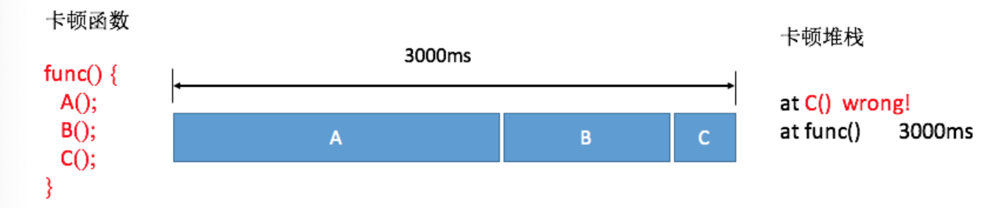

### 二、卡顿监控
#### 卡顿监控
##### 1、基于消息队列监控卡顿
启动一个监控线程，每个 1s 向主线程消息队列的头部插入一条空消息，假设 1s 后没有被主线程消耗调，则说明阻塞消息运行的时间是 0~1 秒。

发送空消息的间隔不能太短，否则处理消息耗费性能。但是基本影响不大。

##### 2、插桩
基于消息队列，可能会不准确。（取样越大，就越能避免这种情况）



##### 3、Profile
Facebook 开源的工具，使用了大量黑科技。搞不懂。

#### 其他监控
卡顿问题，不仅要监控主线程是否耗时过长，还需要监控其他的指标。

如 Android Vitals 是 Google Play 官方的性能监控服务，涉及到的指标有： ANR、启动、帧率。

#### 1、帧率
可以通过 Choreographer 来监控应用的帧率。跟卡顿不同，应该只监控存在绘制的界面。

可以通过 addOnDrawListenner 来监听是否存在绘制。

```
getWindow(().getDecorView().getViewTreeObserver().addOnDrawListener
```

Android Vitals将连续丢帧超过700毫秒定义为冻帧，也就是连续丢帧42帧以上。

我们需要关注的就是冻帧率，也就是发生冻帧的时间和所有时间的比值。当发生冻帧的时候，需要统计页码信息，View 信息，和操作路径，上报后台。

#### 2、生命周期监控
Activity、Service、Receiver 组件的生命周期应该全量监控并上报。


除了四大组件的生命周期，还需要监控各个进程生命周期的启动次数和耗时。


#### 3、线程监控
主要关注两点：

• 线程数量 ： 需要监控线程的数量以及创建的方式（是否使用了我们自己的线程池），可以通过 got hook 线程的 nativeCreate() 函数。

• 线程时间。监控线程的用户时间 utime、系统时间stime，查看是否占用了太多的cpu。

除了这些之外，导致卡顿的原因有很多：函数非常耗时，i/o 非常慢，线程间的竞争或者锁。

#### 三、ftrace 
ftrace: 帮助开发人员了解 Linux 内核的运行时行为，从而进行故障调试和性能分析。

ftrace 的实现依赖其他许多内核特性，比如 tracepoint,debugfs,kprobe,IRQ-Flags.

关于 trance point 和 debugfs ：

内核采用 "插桩" 的方法抓取 log，插桩，即 trace point ，每种 trace point 都有一个 name，一个 enable 开关，一系列函数，注册函数、卸载函数 。桩函数会把信息打印到 ring buffer ，这些信息通过 debufs 对用户呈现。


kprobe 介绍：

kprobe 是一个动态手机调试和性能信息的工具，可以跟踪任何函数或被执行的指令以及一些异常事件。

其基本工作原理是，通过指定一个探测点，并把这个探测点和一个处理函数关联，当执行到探测点时，相应的关联函数会被执行。

Ftrace 由 RedHad 的 Steve Rostedt 负责维护，到 2.6.30 支持的 trancer 包括：

• Function tracer &  Function graph tracer : 跟踪函数调用

• Schedule switch tracer:跟踪进程调度情况

• Wakeup tracer : 跟踪进程的调度延迟。

• Irqsoff tracer: 跟踪并记录哪些函数禁止了中断，对于中断禁止时间最长的，在在结果的 lgo 第一行文件标出，从而定位造成延迟的罪魁祸首。

• Premptirasoff tracer : 同上，跟踪并记录禁止中断或者禁止抢占的内核函数，以及禁止时间最长的函数。

• Branch tracer: 跟踪内核程序中 Lickely/unLikely 分支预测命中率情况，为优化程序提供线索。

• Hardware branch tracer : 利用处理器的分支跟踪能力，实现硬件级别的指令跳转记录。

• Initcall tracer : 记录系统在 boot 阶段所调用的 init call 

• Mmiotrace tracer : 记录 memrory map io 的相关信息。

• Power tracer : 记录系统电源管理相关的信息。

• Sysprof tracer : 每隔 1msec 对内核进行一次采样，记录函数调用和堆栈信息。

• kernel memeory tracker : 跟踪 slab allocator 的分配情况，根据收集的信息可以分析内部碎片情况，找出内存分配最频繁的代码片段。

• Workqueue statistical tracer : 统计系统中所有的 workqueue 的工作情况。

• Event tracer : 跟踪系统事件，比如 timer，系统调用，中断。


# Chapter06

该项目展示了使用 PLTHook 技术来获取 Atrace 的日志，可以学习到systrace的一些底层机制

运行环境
=====
AndroidStudio3.2
NDK16~19
支持 `x86` `armeabi-v7a`


说明
======

运行项目后点击`开启 Atrace 日志`，然后就可以在Logcat 日志中查看到捕获的日志，类似如下：

```
 ========= B|5667|Lock contention on task queue lock (owner tid: 5667)
 ========= B|5667|JIT compiling int android.view.MotionEvent.getAction()
 ========= E
 ========= B|5667|Compiling
 ========= B|5667|ScopedCodeCacheWrite
 ========= B|5667|mprotect all
 ========= E
 ========= E
 ========= B|5667|mprotect code
 ========= B|5667|ScopedCodeCacheWrite
 ========= B|5667|mprotect all
 ========= B|5667|mprotect code
 ========= B|5667|TrimMaps
 ========= B|5667|void art::ArenaPool::TrimMaps()
```

可以通过B|事件和E|事件是成对出现的，这样就可以获得每个事件使用的时间。

关键实现
====
### hookLoadedLibs

使用plt hook libc的 write 相关方法，其中第一个参数意思是准备Hook的library名字。


这里我们用的是profilo中提供的plt hook库。

### write_hook
这里为了提升性能，只hook atrace_marker 文件对应的fd

```
ssize_t write_hook(int fd, const void *buf, size_t count) {
    if (should_log_systrace(fd, count)) {
        log_systrace(buf, count);
        return count;
    }
    return CALL_PREV(write_hook, fd, buf, count);
}
```

这里我们可能要理解一下ftrace和atrace的机制，可以参考以下参考文章：

1. [使用 ftrace](https://source.android.com/devices/tech/debug/ftrace)
2. [ftrace Documentation](https://www.kernel.org/doc/Documentation/trace/ftrace.txt)
3. [ftrace 简介](https://www.ibm.com/developerworks/cn/linux/l-cn-ftrace/index.html)
4. [atrace.cpp](https://android.googlesource.com/platform/frameworks/native/+/master/cmds/atrace/atrace.cpp)

### installSystraceSnooper
通过dlsym调用libcutils.so的方法，直接打开atrace。 这里需要适配Android版本小于18的情况

有人可能好奇类似"_ZN7android6Tracer12sEnabledTagsE"这样的名字是怎么样找出来的，我们可以参考[这篇文章](http://bramante.github.io/blog/2015/08/20/demangle-c-plus-plus-symbols/)。

```
c++filt -n _ZN7android6Tracer12sEnabledTagsE

android::Tracer::sEnabledTags
```

也可以直接objdump对应的so得到。

Thanks
======

[Profilo](https://github.com/facebookincubator/profilo)