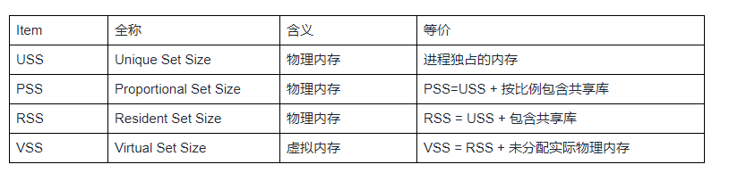
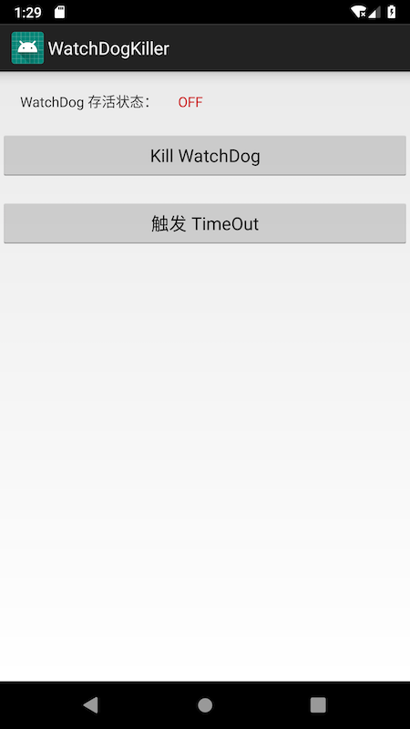

#### 一、Android 内存分析相关知识
##### 内存指标概念



大小关系： VSS >= RSS >= PSS >= USS

##### 常用的内存分析命令
1、dumpsys meminfo (输出内存相关信息)

adb shell 里面输入 : dumpsys meminfo 之后，输出的内容：

```
Total PSS by process: //以process来划分
   167128 kB: com.android.systemui (pid 4395)
   124527 kB: system (pid 1192)
    44213 kB: com.android.settings (pid 29256 / activities)
    41822 kB: surfaceflinger (pid 391)
    ...
Total PSS by OOM adjustment: //以oom来划分，会详细列举所有的类别的进程，此处省略.
   183683 kB: Native
        42024 kB: surfaceflinger (pid 388)
        16740 kB: mediaserver (pid 471)
        16040 kB: zygote (pid 494)
        ...
   124527 kB: System
   344259 kB: Persistent
    69719 kB: Foreground
    49026 kB: Visible
    34005 kB: Perceptible
     7880 kB: A Services
    58689 kB: Home
    98352 kB: B Services
    94888 kB: Cached
Total PSS by category:  // 以category划分
   309449 kB: Dalvik
   230330 kB: Native
   145344 kB: EGL mtrack
   117797 kB: .so mmap
    54389 kB: .art mmap
    44886 kB: .dex mmap
    32428 kB: Dalvik Other
    31083 kB: .oat mmap
    29456 kB: Stack
    21782 kB: Gfx dev
    21733 kB: Unknown
    12695 kB: .apk mmap
     9367 kB: Other mmap
     2169 kB: .ttf mmap
     2062 kB: Other dev
       38 kB: .jar mmap
       12 kB: Ashmem
        8 kB: Cursor
        0 kB: GL mtrack
        0 kB: Other mtrack
//整体情况
Total RAM: 2857032 kB (status moderate)
 Free RAM: 1439488 kB (94888 cached pss + 344620 cached kernel + 999980 free)
 Used RAM: 1280552 kB (970140 used pss + 310412 kernel)
 Lost RAM: 136992 kB
     ZRAM: 4 kB physical used for 0 kB in swap (524284 kB total swap)
   Tuning: 256 (large 512), oom 525000 kB, restore limit 175000 kB (high-end-gfx)
```

另外，可以只输出某个 pid 或者 Package 的进程信息

如，运行如下命令：

dumpsys meminfo --package com.tencent.mm

完整的输出信息如下：
```

Applications Memory Usage (in Kilobytes):
Uptime: 49304776 Realtime: 149302666
** MEMINFO in pid 20830 [com.tencent.mm:appbrand0] **
                   Pss  Private  Private  SwapPss     Heap     Heap     Heap
                 Total    Dirty    Clean    Dirty     Size    Alloc     Free
                ------   ------   ------   ------   ------   ------   ------
  Native Heap     7374     7356        0        0    51200    32192    19007
  Dalvik Heap    13013    12984        0        0    20928    18880     2048
 Dalvik Other     6321     6320        0     3932
        Stack     3856     3856        0     5364
       Ashmem      136      128        0        0
    Other dev        5        0        4        0
     .so mmap    10630      820     9020     5702
    .apk mmap     1794     1328        0    10076
    .dex mmap     3037     2312      584    62344
    .oat mmap     2497        0        0        0
    .art mmap     1400     1000        0      257
   Other mmap      205        8        4        0
      Unknown    16928    16928        0    17121
        TOTAL   171992    53040     9612   104796    72128    51072    21055
 App Summary
                       Pss(KB)
                        ------
           Java Heap:    13984
         Native Heap:     7356
                Code:    14064
               Stack:     3856
            Graphics:        0
       Private Other:    23392
              System:   109340
               TOTAL:   171992       TOTAL SWAP PSS:   104796
 Objects
               Views:        8         ViewRootImpl:        0
         AppContexts:        3           Activities:        0
              Assets:        5        AssetManagers:        3
       Local Binders:       36        Proxy Binders:       27
       Parcel memory:       40         Parcel count:      160
    Death Recipients:        3      OpenSSL Sockets:        0
 Dalvik
         isLargeHeap:     true
 SQL
         MEMORY_USED:        0
  PAGECACHE_OVERFLOW:        0          MALLOC_SIZE:        0
 Asset Allocations
    zip:/data/user/0/com.tencent.mm/tinker/patch-59ce9dd1/res/resources.apk:/resources.arsc: 5584K
    zip:/data/user/0/com.tencent.mm/app_xwalk_1169/apk/base.apk:/resources.arsc: 373K
** MEMINFO in pid 20452 [com.tencent.mm:push] **
                   Pss  Private  Private  SwapPss     Heap     Heap     Heap
                 Total    Dirty    Clean    Dirty     Size    Alloc     Free
                ------   ------   ------   ------   ------   ------   ------
  Native Heap     4138     4124        0        0    28672    13841    14830
  Dalvik Heap    13457    13428        0        0    21600    17504     4096
 Dalvik Other     6261     6260        0     4000
        Stack     1864     1864        0     1304
    Other dev       10        0        8        0
     .so mmap     4328      272     2644     1095
    .apk mmap     1616     1616        0     9644
    .dex mmap     3118     2896       56    61752
    .oat mmap     1759        0        0        0
    .art mmap     1547     1004        0       98
   Other mmap       55        8       28        0
      Unknown      477      476        0      798
        TOTAL   117321    31948     2736    78691    50272    31345    18926
 App Summary
                       Pss(KB)
                        ------
           Java Heap:    14432
         Native Heap:     4124
                Code:     7484
               Stack:     1864
            Graphics:        0
       Private Other:     6780
              System:    82637
               TOTAL:   117321       TOTAL SWAP PSS:    78691
 Objects
               Views:        0         ViewRootImpl:        0
         AppContexts:        3           Activities:        0
              Assets:        3        AssetManagers:        2
       Local Binders:       25        Proxy Binders:       28
       Parcel memory:       39         Parcel count:      158
    Death Recipients:        5      OpenSSL Sockets:        0
 Dalvik
         isLargeHeap:     true
 SQL
         MEMORY_USED:        0
  PAGECACHE_OVERFLOW:        0          MALLOC_SIZE:        0
 Asset Allocations
    zip:/data/user/0/com.tencent.mm/tinker/patch-59ce9dd1/res/resources.apk:/resources.arsc: 5584K
** MEMINFO in pid 20836 [com.tencent.mm:appbrand1] **
                   Pss  Private  Private  SwapPss     Heap     Heap     Heap
                 Total    Dirty    Clean    Dirty     Size    Alloc     Free
                ------   ------   ------   ------   ------   ------   ------
  Native Heap     3166     3148        0        0    36864    22937    13926
  Dalvik Heap    11313    11284        0        0    19567    17519     2048
 Dalvik Other     5749     5748        0     3788
        Stack     1836     1836        0     1280
       Ashmem      128      128        0        0
    Other dev        5        0        4        0
     .so mmap      744      112        0     3022
    .apk mmap     1954     1488        0     9916
    .dex mmap     2753     2580       32    62076
    .oat mmap     2069        0        0        0
    .art mmap     1324      924        0      174
   Other mmap      205        8        4        0
      Unknown      448      448        0    12757
        TOTAL   124707    27704       40    93013    56431    40456    15974
 App Summary
                       Pss(KB)
                        ------
           Java Heap:    12208
         Native Heap:     3148
                Code:     4212
               Stack:     1836
            Graphics:        0
       Private Other:     6340
              System:    96963
               TOTAL:   124707       TOTAL SWAP PSS:    93013
 Objects
               Views:       18         ViewRootImpl:        0
         AppContexts:        3           Activities:        0
              Assets:        4        AssetManagers:        2
       Local Binders:       25        Proxy Binders:       22
       Parcel memory:       37         Parcel count:      148
    Death Recipients:        3      OpenSSL Sockets:        0
 Dalvik
         isLargeHeap:     true
 SQL
         MEMORY_USED:        0
  PAGECACHE_OVERFLOW:        0          MALLOC_SIZE:        0
 Asset Allocations
    zip:/data/user/0/com.tencent.mm/tinker/patch-59ce9dd1/res/resources.apk:/resources.arsc: 5584K
** MEMINFO in pid 21151 [com.tencent.mm] **
                   Pss  Private  Private  SwapPss     Heap     Heap     Heap
                 Total    Dirty    Clean    Dirty     Size    Alloc     Free
                ------   ------   ------   ------   ------   ------   ------
  Native Heap    28874    28816       32        0    77824    44071    33752
  Dalvik Heap    65893    65868        0        0    70423    66327     4096
 Dalvik Other    20937    20936        0     1956
        Stack     3388     3388        0     1792
       Ashmem        2        0        0        0
    Other dev        5        0        4        0
     .so mmap    12598      668     8920     5515
    .apk mmap     7872     7288      404     3972
    .ttf mmap       90        0        0        0
    .dex mmap    23115    21192     1756    43460
    .oat mmap     3789        0       64        0
    .art mmap     2644     1812       52      132
   Other mmap      613        8      392        0
      Unknown     1042     1040        0     1587
        TOTAL   229276   151016    11624    58414   148247   110398    37848
 App Summary
                       Pss(KB)
                        ------
           Java Heap:    67732
         Native Heap:    28816
                Code:    40292
               Stack:     3388
            Graphics:        0
       Private Other:    22412
              System:    66636
               TOTAL:   229276       TOTAL SWAP PSS:    58414
 Objects
               Views:      366         ViewRootImpl:        0
         AppContexts:        5           Activities:        1
              Assets:        3        AssetManagers:        3
       Local Binders:       96        Proxy Binders:       61
       Parcel memory:       63         Parcel count:      253
    Death Recipients:        9      OpenSSL Sockets:        0
 Dalvik
         isLargeHeap:     true
 SQL
         MEMORY_USED:      163
  PAGECACHE_OVERFLOW:       34          MALLOC_SIZE:       62
 DATABASES
      pgsz     dbsz   Lookaside(b)          cache  Dbname
         4      108            261       31/30/16  /data/user/0/com.tencent.mm/databases/google_app_measurement.db
 Asset Allocations
    zip:/data/user/0/com.tencent.mm/tinker/patch-59ce9dd1/res/resources.apk:/resources.arsc: 5584K

```


2、procrank （有的手机没有这个命令工具）

procrank  可以 获取所有进程的内存使用的排行榜，排行是以Pss的大小而排序。
procrank命令比dumpsys meminfo命令，能输出更详细的VSS/RSS/PSS/USS内存指标。

执行结果：
```
root@Phone:/# procrank
  PID       Vss      Rss      Pss      Uss  cmdline
 4395  2270020K  202312K  136099K  121964K  com.android.systemui
 1192  2280404K  147048K   89883K   84144K  system_server
29256  2145676K   97880K   44328K   40676K  com.android.settings
  501  1458332K   61876K   23609K    9736K  zygote
 4239  2105784K   68056K   21665K   19592K  com.android.phone
  479   164392K   24068K   17970K   15364K  /system/bin/mediaserver
  391   200892K   27272K   15930K   11664K  /system/bin/surfaceflinger
...
RAM: 2857032K total, 998088K free, 78060K buffers, 459780K cached, 312K shmem, 92392K slab

```

3、cat/proc/meminfo

输出更详细的内存信息。

```
root@phone:/ # cat /proc/meminfo
MemTotal:        2857.032 kB  //RAM可用的总大小 (即物理总内存减去系统预留和内核二进制代码大小)
MemFree:         1020.708 kB  //RAM未使用的大小
Buffers:           75.104 kB  //用于文件缓冲
Cached:           448.244 kB  //用于高速缓存
SwapCached:             0 kB  //用于swap缓存
Active:           832.900 kB  //活跃使用状态，记录最近使用过的内存，通常不回收用于其它目的
Inactive:         391.128 kB  //非活跃使用状态，记录最近并没有使用过的内存，能够被回收用于其他目的
Active(anon):     700.744 kB  //Active = Active(anon) + Active(file)
Inactive(anon):       228 kB  //Inactive = Inactive(anon) + Inactive(file)
Active(file):     132.156 kB
Inactive(file):   390.900 kB
Unevictable:            0 kB
Mlocked:                0 kB
SwapTotal:        524.284 kB  //swap总大小
SwapFree:         524.284 kB  //swap可用大小
Dirty:                  0 kB  //等待往磁盘回写的大小
Writeback:              0 kB  //正在往磁盘回写的大小
AnonPages:        700.700 kB  //匿名页，用户空间的页表，没有对应的文件
Mapped:           187.096 kB  //文件通过mmap分配的内存，用于map设备、文件或者库
Shmem:               .312 kB
Slab:              91.276 kB  //kernel数据结构的缓存大小，Slab=SReclaimable+SUnreclaim
SReclaimable:      32.484 kB  //可回收的slab的大小
SUnreclaim:        58.792 kB  //不可回收slab的大小
KernelStack:       25.024 kB
PageTables:        23.752 kB  //以最低的页表级
NFS_Unstable:           0 kB  //不稳定页表的大小
Bounce:                 0 kB
WritebackTmp:           0 kB
CommitLimit:     1952.800 kB
Committed_AS:   82204.348 kB   //评估完成的工作量，代表最糟糕case下的值，该值也包含swap内存
VmallocTotal:  251658.176 kB  //总分配的虚拟地址空间
VmallocUsed:      166.648 kB  //已使用的虚拟地址空间
VmallocChunk:  251398.700 kB  //虚拟地址空间可用的最大连续内存块
4、free
free 命令可以查看内存，主要是查看剩余内存情况，数据来源于 /proc/meminfo
root@phone:/proc/sys/vm # free
             total         used         free       shared      buffers
Mem:       2857032      1836040      1020992            0        75104
-/+ buffers:            1760936      1096096
Swap:       524284            0       524284

```

• 对于Mem行，存在的公式关系： total = used + free;

• 对于-/+ buffers行： 1760936 = 1836040 - 75104(buffers); 1096096 = 1020992 + 75104(buffers);

5、showmap（有的手机没有）

showmap 主要用于查看虚拟地址区域的内存情况

用法：

showmap -a [pid]

该命令的输出每一行代表一个虚拟地址区域(vm area)
```

root@phone:/ # showmap -a 10901
   start    end      virtual                   shared   shared  private  private
    addr     addr     size      RSS      PSS    clean    dirty    clean    dirty object
-------- -------- -------- -------- -------- -------- -------- -------- -------- ------------------------------
f3b87000 f3d85000     2040        4        4        0        0        4        0 /dev/binder

```

• start addr和end addr:分别代表进程空间的起止虚拟地址；

• virtual size/ RSS /PSS这些前面介绍过；

• shared clean：代表多个进程的虚拟地址可指向这块物理空间，即有多少个进程共享这个库；

• shared: 共享数据

• private: 该进程私有数据

• clean: 干净数据，是指该内存数据与disk数据一致，当内存紧张时，可直接释放内存，不需要回写到disk\

• dirty: 脏数据，与disk数据不一致，需要先回写到disk，才能被释放。

6、vmstat

主功能：不仅可以查看内存情况，还可以查看进程运行队列、系统切换、CPU时间占比等情况，另外该指令还是周期性地动态输出。
 
用法：

```
Usage: vmstat [ -n iterations ] [ -d delay ] [ -r header_repeat ]
    -n iterations     数据循环输出的次数
    -d delay          两次数据间的延迟时长(单位：S)
    -r header_repeat  循环多少次，再输出一次头信息行
```
```
    
root@phone:/ # vmstat
procs  memory                       system          cpu
 r  b   free  mapped   anon   slab    in   cs  flt  us ni sy id wa ir
 2  0  663436 232836 915192 113960   196  274    0   8  0  2 99  0  0
 0  0  663444 232836 915108 113960   180  260    0   7  0  3 99  0  0
 0  0  663476 232836 915216 113960   154  224    0   2  0  5 99  0  0
 1  0  663132 232836 915304 113960   179  259    0  11  0  3 99  0  0
 2  0  663124 232836 915096 113960   110  175    0   4  0  3 99  0  0
 
```    
    
    
    
参数列总共15个参数，分为4大类：

• procs(进程)

• r: Running队列中进程数量

• b: IO wait的进程数量

• memory(内存)

• free: 可用内存大小

• mapped：mmap映射的内存大小

• anon: 匿名内存大小

• slab: slab的内存大小

• system(系统)

• in: 每秒的中断次数(包括时钟中断)

• cs: 每秒上下文切换的次数

• cpu(处理器)

• us: user time

• ni: nice time

• sy: system time

• id: idle time

• wa: iowait time

• ir: interrupt time

#### 二、崩溃现场信息采集

##### 1、崩溃相关信息

• 进程名、线程名，前台进程还是后台进程，是否是 UI 进程。

• 崩溃堆栈和类型。

      确定崩溃是属于 Java 崩溃、Nativie 崩溃，还是 ANR.
      
##### 2、系统信息

• Logcat

包括应用、系统的运行日志。其中系统的 event logcat 记录在 /system/etc/event-log-tags 中。

• 机型、系统、厂商、CPU、ABI，Linux 版本等。

• 设备状态

是否 root，是否是模拟器（Xposed 开发软件等问题）

##### 3、内存信息
• 系统剩余内存 （当剩余内存少时，就可能会引起 OOM,GC,系统频繁自杀、拉起等）

  系统内存状态，可以通过直接读取 /proc/meminfo 来获取。
  
• 应用使用内存

包括 Java 内存、RSS(Resident Set Size)、PSS(Proportional Set Size) 。

PSS  和 RSS 可以通过 /proc/self/smap  计算，可以进一步得到apk.dex.so 等详细的分类统计。

• 虚拟内存

虚拟内存可以通过/proc/self/status得到，通过/proc/self/maps文件可以得到具体的分布情况。

4、资源信息

• 文件句柄 fd

文件句柄的限制可以通过/proc/self/limits获得，一般单个进程允许打开的最大文件句柄个数为1024。但是如果文件句柄超过800个就比较危险，需要将所有的fd以及对应的文件名输出到日志中，进一步排查是否出现了有文件或者线程的泄漏。

• 线程数

当前线程数大小可以通过上面的status文件得到，一个线程可能就占2MB的虚拟内存，过多的线程会对虚拟内存和文件句柄带来压力。根据我的经验来说，如果线程数超过400个就比较危险。需要将所有的线程id以及对应的线程名输出到日志中，进一步排查是否出现了线程相关的问题。

• JNI

使用JNI时，如果不注意很容易出现引用失效、引用爆表等一些崩溃。我们可以通过DumpReferenceTables统计JNI的引用表，进一步分析是否出现了JNI泄漏等问题。

##### 5、应用信息

除了系统，其实我们的应用更懂自己，可以留下很多相关的信息。

• 崩溃场景。崩溃发生在哪个Activity或Fragment，发生在哪个业务中。

• 关键操作路径。不同于开发过程详细的打点日志，我们可以记录关键的用户操作路径，这对我们复现崩溃会有比较大的帮助。

• 其他自定义信息。不同的应用关心的重点可能不太一样，比如网易云音乐会关注当前播放的音乐，QQ浏览器会关注当前打开的网址或视频。此外例如运行时间、是否加载了补丁、是否是全新安装或升级等信息也非常重要。

除了上面这些通用的信息外，针对特定的一些崩溃，我们可能还需要获取类似磁盘空间、电量、网络使用等特定信息。所以说一个好的崩溃捕获工具，会根据场景为我们采集足够多的信息，让我们有更多的线索去分析和定位问题。当然数据的采集需要注意用户隐私，做到足够强度的加密和脱敏。

#### 三、奔溃分析与解决
##### 第一步 ，确定重点

1、确认严重程度，分优先级

2、崩溃基本信息

Java 崩溃：Java崩溃类型比较明显，比如NullPointerException是空指针，OutOfMemoryError是资源不足，这个时候需要去进一步查看日志中的 “内存信息”和“资源信息”。

Native 奔溃：需要观察signal、code、fault addr等内容，以及崩溃时Java的堆栈。关于各signal含义的介绍，你可以查看崩溃信号介绍。比较常见的是有SIGSEGV和SIGABRT，前者一般是由于空指针、非法指针造成，后者主要因为ANR和调用abort() 退出所导致。

ANR: 先看看主线程的堆栈，是否是因为锁等待导致。接着看看ANR日志中iowait、CPU、GC、system server等信息，进一步确定是I/O问题，或是CPU竞争问题，还是由于大量GC导致卡死。

3、Logcat 

Logcat一般会存在一些有价值的线索，日志级别是Warning、Error的需要特别注意。从Logcat中我们可以看到当时系统的一些行为跟手机的状态，例如出现ANR时，会有“am_anr”；App被杀时，会有“am_kill”。不同的系统、厂商输出的日志有所差别，当从一条崩溃日志中无法看出问题的原因，或者得不到有用信息时，不要放弃，建议查看相同崩溃点下的更多崩溃日志。

4、各个资源情况

结合崩溃的基本信息，我们接着看看是不是跟 “内存信息” 有关，是不是跟“资源信息”有关。比如是物理内存不足、虚拟内存不足，还是文件句柄fd泄漏了。

#####  第二步，查找共性
机型、系统、ROM、厂商、ABI，这些采集到的系统信息都可以作为维度聚合，共性问题例如是不是因为安装了Xposed，是不是只出现在x86的手机，是不是只有三星这款机型，是不是只在Android 5.0的系统上。应用信息也可以作为维度来聚合，比如正在打开的链接、正在播放的视频、国家、地区等。
 
##### 第三步，尝试复现

对于系统崩溃问题， 可能很难复现，常用的解决手段有：

1. 查找可能的原因。通过上面的共性归类，我们先看看是某个系统版本的问题，还是某个厂商特定ROM的问题。虽然崩溃日志可能没有我们自己的代码，但通过操作路径和日志，我们可以找到一些怀疑的点。

2. 尝试规避。查看可疑的代码调用，是否使用了不恰当的API，是否可以更换其他的实现方式规避。

3. Hook解决。这里分为Java Hook和Native Hook。


##### WatchDog
Android Watchdog主要是检测system server重要线程状态(main,android io,android display ,Activitymanager,android fg,android bg等线程 )的一种机制。发生Watchdog时会触发Android重启来使系统恢复。Watchdog是SystemServer的一个线程（class Watchdog extends Thread），检测system server重要线程的锁状态和消息是否阻塞，假如有线程block了60s那么就会触发watchdog timeout flow。


简介
======
该例子主要演示了如何通过关闭`FinalizerWatchdogDaemon`来减少`TimeoutException`的触发

需要注意的是，此种方法并不是去解决问题，而是为了避免上报异常采取的一种 hack 方案，并没有真正的解决引起 `finialize()` 超时的问题。

界面
======




操作步骤
======

1. 最好在模拟器下执行例子，因为各个手机设置的超时时长不同，不容易观看效果。
2. 点击`触发 Timeout`按钮，等待10多秒后，应用会触发 TimeOut Crash，产生如下日志 


```
D/ghost: =============fire finalize=============FinalizerDaemon
I/.watchdogkille: Thread[3,tid=4369,WaitingInMainSignalCatcherLoop,Thread*=0x76e6ece16400,peer=0x149802d0,"Signal Catcher"]: reacting to signal 3
I/.watchdogkille: Wrote stack traces to '[tombstoned]'
E/AndroidRuntime: FATAL EXCEPTION: FinalizerWatchdogDaemon
    Process: com.dodola.watchdogkiller, PID: 4363
    java.util.concurrent.TimeoutException: com.dodola.watchdogkiller.GhostObject.finalize() timed out after 10 seconds
        at java.lang.Thread.sleep(Native Method)
        at java.lang.Thread.sleep(Thread.java:373)
        at java.lang.Thread.sleep(Thread.java:314)
        at com.dodola.watchdogkiller.GhostObject.finalize(GhostObject.java:13)
        at java.lang.Daemons$FinalizerDaemon.doFinalize(Daemons.java:250)
        at java.lang.Daemons$FinalizerDaemon.runInternal(Daemons.java:237)
        at java.lang.Daemons$Daemon.run(Daemons.java:103)
        at java.lang.Thread.run(Thread.java:764)
I/Process: Sending signal. PID: 4363 SIG: 9

```
3. 点击`Kill WatchDog` 按钮可以关闭 Timeout watchdog，然后点击`触发 TimeOut` 按钮观察情况，正常情况下不会产生 crash
