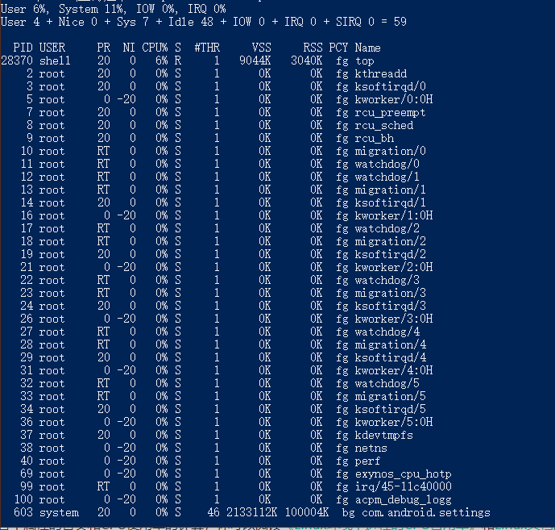
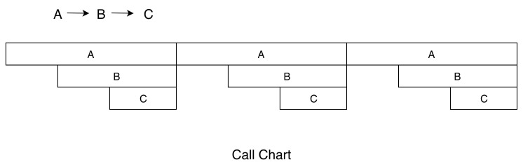
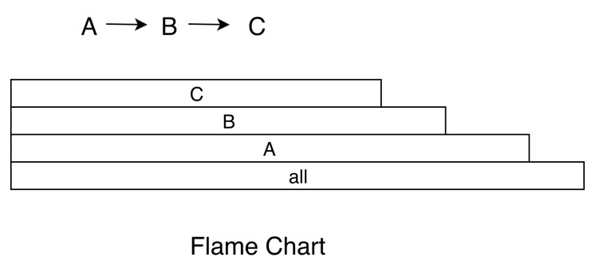

### 卡顿优化
####  一、卡顿分析方法
用户时间：执行用户态应用程序代码所消耗时间

系统时间：执行内核态系统调用所消耗的时间

###### 1、cpu 性能
查看 cpu 架构相关信息
```
cat /proc/cpuinfo
```

获取设备 cpu 信息
```
//获取 cpu 核心数
cat /sys/devices/system/cpu/possible
// 获取某个 cpu 的频率
 cat /sys/devices/system/cup/cpu0/cpufreq/cpuinfo_max_freq
```

###### 2、卡顿问题分析指标
要分析卡顿问题，首先需要分析 cpu 的使用率
```
/proc/stat ： 得到整个系统的  cpu 使用情况
/proc/[pid]/stat : 某个进程的 cpu 使用情况
```

这里面的比较重要的字段：

proc/self/stat:

  utime:       用户时间，反应用户代码执行的耗时  
  
  stime:       系统时间，反应系统调用执行的耗时
  
  majorFaults：需要硬盘拷贝的缺页次数
  
  minorFaults：无需硬盘拷贝的缺页次数

cup 的使用率计算：

cup 的使用率长期大于 60% ，表示系统繁忙

对于普通应用，系统时间不会超过 30%

Linux 相关命令学习：

• top : 查看进程消耗排序

用法： adb shell  top



每一组数据的含义：

User  处于用户态的运行时间，不包含优先值为负进程 

Nice  优先值为负的进程所占用的CPU时间 

Sys   处于核心态的运行时间 

Idle  除IO等待时间以外的其它等待时间 

IOW   IO等待时间 

IRQ   硬中断时间 

SIRQ  软中断时间

第二组数据的含义：

PID   进程id

PR    优先级

CPU%  当前瞬时CPU占用率

S     进程状态:D=不可中断的睡眠状态, R=运行, S=睡眠, T=跟踪/停止, Z=僵尸进程

#THR  程序当前所用的线程数

VSS   Virtual Set Size  虚拟耗用内存（包含共享库占用的内存）

RSS   Resident Set Size 实际使用物理内存（包含共享库占用的内存）

PCY   调度策略优先级，SP_BACKGROUND/SP_FOREGROUND

UID   进程所有者的用户id

Name  进程的名称


• vmstat : 动态监控 os 虚拟内存和 cpu 活动
  用法：
```
vmstat 1 3
```
1： 表示每 1 秒重新测量并反馈数据，

3： 表示执行三次之后，关闭
```

procs -----------memory---------- ---swap-- -----io---- -system-- ----cpu----
 r  b   swpd   free   buff  cache   si   so    bi    bo   in   cs us sy id wa
 0  0      0  57080  50060 1429612   0    0   712    67    0  237 10  6 83  0
 0  0      0  57064  50060 1429612   0    0     0     0    0  181  0  0 100 0
 0  0      0  57064  50060 1429612   0    0     0     0    0  100  0  0 100 0
```

各项含义：

Procs:

r: 运行中的进程数，即多少个进程分配到了 cpu

b:阻塞的进程数，通常是等待 io 

memory(kB):

 swpad: 使用的虚拟内存大小，如果大于0，表示物理内存不足，可能就是内存泄露或者后台执行任务太多造成的。

free: 系统可用物理内存

buff:系统用作 buffers 的内存，用来存储比如目录中的内容，权限等的缓存

cache: 缓存，也就是把一部分内存拿来缓存。

Swap:

si : 每秒从磁盘读入的内存大小，如果这个值大于 0，表示内存不够，需要排查。

so: 写回磁盘。

IO

bi: 块设备接收的块数量。

bo: 块设备发出的数量。

System:

in: 中断数（默认一秒内）

cs: 系统上下文切换的次数，例如进程切换，线程切换，代码进入内核等。

cpu:

us: 用户占用 cpu 时间比值

sy: 系统占用

id:闲置 ，一般来说 id  + us + sy = 100%

wa: 等待的，


• strace : 跟踪某个进程的所有系统调用

• uptime ： 查看 cpu 负载 （一般平均负载建议控制在“0.7 × 核数”以内。）

关于线程切换，如果频繁的进行线程切换，也会消耗性能，可以通过 vmstat 或者 /proc/pid/schedstat 来查看 cpu 上下文切换次数。

proc/self/sched:

  nr_voluntary_switches：     

  主动上下文切换次数，因为线程无法获取所需资源导致上下文切换，最普遍的是IO。    

  nr_involuntary_switches：   

  被动上下文切换次数，线程被系统强制调度导致上下文切换，例如大量线程在抢占CPU。

  se.statistics.iowait_count：IO 等待的次数

  se.statistics.iowait_sum：  IO 等待的时间

关于线程优先级，线程优先级会影响 cpu 饱和度，线程优先级由 nice 和 cgroup 类型共同决定，nice 值越低，抢占 cpu 越强，当 cup 繁忙是，会对执行效率有影响。


##### 3、Android 卡顿排查工具
基本所有的工具都可以分成两类：

instrument 类： 一段时间内，所有函数的调用统计。

##### sample 类： 抽样统计。
###### 1、TraceView(instrument)
TraceView  利用 Android Runtime 函数调用的 event 事件，将函数运行的耗时和调用关系写入 trace 文件中。

缺点是，无法真实反映函数执行时间（开启 TraceView 会额外耗时）

android 5.0 之后，新增了 startMethodTracingSasmpling 方法，可以基于样本的方式进行分析，以减少分析对运行时的性能影响。

但是无论那种形式，对 release 支持都不是很好。如，无法反混淆。

###### 2、Nanoscope(Uber 开源，Instrument)
这个工具实现原理是修改了 Android 虚拟机源码，相当于定制的，不通用。

###### 3、systrace(sample)
android 4.1 新增的性能分析工具，通常使用 systrace 跟踪 i/o 操作，cpu 负载，Surface 渲染，gc 事件等。

systrace 在 Android 上，相当于是在 Linux ftrace 的基础上封装了 atrace 。由于系统预留了

Trace.beginSection接口来监听应用程序的调用耗时，那我们有没有办法在systrace上面自动增加应用程序的耗时分析呢？，

我们可以通过编译时给每个函数插桩的方式来实现，也就是在重要函数的入口和出口分别增加Trace.beginSection和Trace.endSection。当然出于性能的考虑，我们会过滤大部分指令数比较少的函数，这样就实现了在systrace基础上增加应用程序耗时的监控。通过这样方式的好处有：

• 可以看到整个流程系统和应用程序的调用流程。包括系统关键线程的函数调用，例如渲染耗时、线程锁，GC耗时等。

• 性能损耗可以接受。由于过滤了大部分的短函数，而且没有放大I/O，所以整个运行耗时不到原来的两倍，基本可以反映真实情况。

systrace生成的也是HTML格式的结果，我们利用跟Nanoscope相似方式实现对反混淆的支持。

###### 4、simpleperf(Sample )
Simpleperf同时封装了systrace的监控功能，通过Android几个版本的优化，现在Simpleperf比较友好地支持Java代码的性能分析。具体来说分几个阶段：

第一个阶段：在Android M和以前，Simpleperf不支持Java代码分析。

第二个阶段：在Android O和以前，需要手动指定编译OAT文件。

第三个阶段：在Android P和以后，无需做任何事情，Simpleperf就可以支持Java代码分析。

从这个过程可以看到Google还是比较看重这个功能，在Android Studio 3.2也在Profiler中直接支持Simpleperf。

###### 5、可视化分析
在Android Studio 3.2的Profiler中直接集成了几种性能分析工具，其中：

• Sample Java Methods的功能类似于Traceview的sample类型。

• Trace Java Methods的功能类似于Traceview的instrument类型。

• Trace System Calls的功能类似于systrace。

• SampleNative (API Level 26+) 的功能类似于Simpleperf。

坦白来说，Profiler界面在某些方面不如这些工具自带的界面，支持配置的参数也不如命令行，不过Profiler的确大大降低了开发者的使用门槛。

另外一个比较大的变化是分析结果的展示方式，这些分析工具都支持了Call Chart和Flame Chart两种展示方式。

Call Chart:

Call Chart是Traceview和systrace默认使用的展示方式。它按照应用程序的函数执行顺序来展示，适合用于分析整个流程的调用。举一个最简单的例子，A函数调用B函数，B函数调用C函数，循环三次，就得到了下面的Call Chart。



Flame Chart(火焰 图)

Flame Chart以一个全局的视野来看待一段时间的调用分布



火焰图还可以使用在各种各样的维度，例如内存、I/O的分析。有些内存可能非常缓慢地泄漏，通过一个内存的火焰图，我们就知道哪些路径申请的内存最多，有了火焰图我们根本不需要分析源代码，也不需要分析整个流程。


### Chapter05
今天我们迎来了第二个课后作业，我们尝试模仿[ProcessCpuTracker.java](http://androidxref.com/9.0.0_r3/xref/frameworks/base/core/java/com/android/internal/os/ProcessCpuTracker.java)拿到一段时间内各个线程的耗时占比

下面是一个结果的样例：
```
usage: CPU usage 5000ms(from 23:23:33.000 to 23:23:38.000):
System TOTAL: 2.1% user + 16% kernel + 9.2% iowait + 0.2% irq + 0.1% softirq + 72% idle
CPU Core: 8
Load Average: 8.74 / 7.74 / 7.36

Process:com.sample.app 
  50% 23468/com.sample.app(S): 11% user + 38% kernel faults:4965

Threads:
  43% 23493/singleThread(R): 6.5% user + 36% kernel faults：3094
  3.2% 23485/RenderThread(S): 2.1% user + 1% kernel faults：329
  0.3% 23468/.sample.app(S): 0.3% user + 0% kernel faults：6
  0.3% 23479/HeapTaskDaemon(S): 0.3% user + 0% kernel faults：982
  ...
```


实现提示
====
统计一段时间内的CPU使用情况

```
processCpuTracker.update();
dosomething();
processCpuTracker.update();
// 输出结果
processCpuTracker.printCurrentState(SystemClock.uptimeMillis());
```

其中数据可以从各个系统文件中获取：

### 系统CPU信息
系统CPU使用率可以通过 /proc/stat 文件获得，各个字段的含义可以参考文件[Linux环境下进程的CPU占用率](http://www.samirchen.com/linux-cpu-performance/)和[Linux文档](http://man7.org/linux/man-pages/man5/proc.5.html)

```
System TOTAL: 2.1% user + 16% kernel + 9.2% iowait + 0.2% irq + 0.1% softirq + 72% idle
```

### CPU核数
可以通过文件/proc/cpuinfo获得

```
CPU Core: 8
```

### 负载
系统通过/proc/loadavg获得

```
Load Average: 8.74 / 7.74 / 7.36
```

### 各线程负载
1. 从/proc/[pid]/stat可以获得进程CPU使用情况
2. 从/proc/[pid]/task/[tid]/stat可以获得进程下面各个线程的CPU使用情况

```
Threads:
  43% 23493/singleThread(R): 6.5% user + 36% kernel faults：3094
  3.2% 23485/RenderThread(S): 2.1% user + 1% kernel faults：329
  0.3% 23468/.sample.io.test(S): 0.3% user + 0% kernel faults：6
  0.3% 23479/HeapTaskDaemon(S): 0.3% user + 0% kernel faults：982
  ...
```
