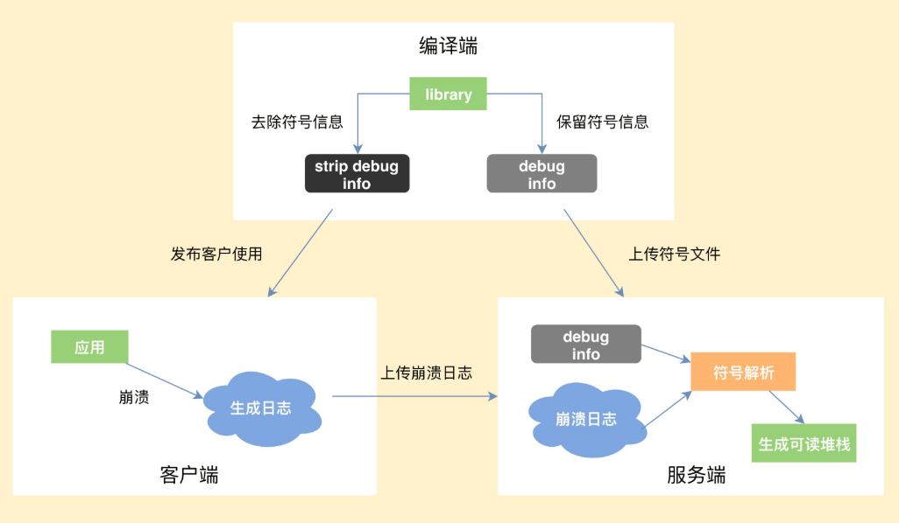

#### 一、Android 中的两种崩溃

##### 1、Java 奔溃
Java 代码中出现了未捕获的异常

##### 2、 Native 奔溃异常
访问非法地址、地址对齐出现问题，或者程序主动 abort ，这些会产生 signal 信号，导致程序异常退出。
##### 3、Nativie 崩溃捕获流程
• 编译端。 编译c/c++ 代码的时候，将带符号信息的文件保留下来。

• 客户端。 崩溃的时候，将收集到的信息写入日志文件，择机上传服务器

• 服务器。 读取上报的日志文件，寻找合适的符好文件，生成可读的 c/c++ 调用栈。



##### 4、Native 崩溃捕获的难点
情况一：文件句柄泄露，导致创建日志文件失败

方案：提前申请文件句柄预留


情况二：栈溢出，导致日志生成失败

方案：可以使用 singalstack


情况三:堆内存耗尽，导致日志生成失败

BreakPad 直接重写封装了 Linux Syscall Support，避免调用 libc


情况四：堆破坏或者二次崩溃导致日志生成失败

方案：从原进程 fork 子进程售价崩溃信息


#### 二、崩溃衡量 以及系统稳定性
```
UV 崩溃率 = 发生崩溃的 UV / 登录 UV
```

系统稳定性包括崩溃和 anr。

anr 的收集：

1、使用 FileObserver 监听 /data/anr/trace.txt 的变化

但是高版本已经没有这个权限了，可以通过 HardCoder 来实现。


2、监控系统队列的运行时间

主要是监控卡顿的。

常见的应用退出场景：

1、自杀

Process.killProcess() 或者 exit

2、崩溃

Java 崩溃或者 Native 崩溃

3、系统重启

系统异常，断电，主动重启等。

4、被系统杀死

如 low memory killer 杀死

5、anr

```
UV 异常率 = 发生异常退出或崩溃的 UV / 登录 UV
```
#### 三、Google Breakpad 练习
##### 1、Google Breakpad 介绍
官方介绍为：Breakpad is a set of client and server components which implement a crash-reporting system.

即 Breakpad 是一套实现了崩溃上报系统的一系列客户端和服务器端组件系统。

Breakpad 是一套完整的工具集，从 crash 的捕获到 crash 的 dump，都提供了相应的工具。它可以记录崩溃的 dump 文件，然后发送回服务器，在服务器根据 minidump 产生 c/c++ 堆栈。

完整的异常上报流程如下：


Breakpad 由三部分组成：

1、客户端

是一个库，需要集成到应用程序中，可以获取当前线程的状态和当前加载的可执行文件和共享库的 ID 写转储文件。可以在这里配置当发送崩溃时，写入 minidump 文件，或者在明确要求写入时。


2、符号卸载器

读取由编译器产生的调试信息，并生成一个使用 Breakpad 格式的符好文件。


3、处理器

读取崩溃产生的 minidump 文件，并根据符好文件生成 c/c++ 堆栈。


2、Breakpad 实践

(1) 下载 breakpad 源码

(2) 新建一个 android 工程

(3) 新建一个 Module


(4) 复制 breakpad 中 src 对于文件到项目中

将 breakpad.cpp 和 CMakeLists.txt 文件复制到对于目录下，将  breakpad 源码里面的 src 目录中文件复制到 src下。

(5) 下载依赖文件

代码中很多地方引用了#include "third_party/lss/linux_syscall_support.h"这个Linux调用库，但源码中并没有给出lss目录，所以我们需要自己翻墙去下载  https://chromium.googlesource.com/linux-syscall-support/   源码，并将lss目录拷贝到third_party下，否则编译不过。


(6) breakpad module 里面对 breakpad 进行初始化

新建一个 java 文件

```
public class BreakpadInit {
    static {
        System.loadLibrary("breakpad-core");
    }
    public static void initBreakpad(String path){
        initBreakpadNative(path);
    }
    private static native void initBreakpadNative(String path);
}


```

(7) 启动 app ，点击按钮产生崩溃

崩溃之后，会在手机根目录下\crashDump\下产生崩溃文件，拿到这个文件。


(8) dump 文件解析

解析需要工具，工具名称是 minidump_stackwalk。这个工具可以通过 Google Breakpad 源码自己编译。也可以在网上找其他人编译过的。tools/mac 下的是 mac 平台上的工具。
但是 AndroidStudio 应该是自带了这个工具，在 Android Studio的安装目录下bin\lldb\bin 下。

通过如下命令进行解析，解析结果保存到 crash.txt 中

```
.\minidump_stackwalk.ext .\crash.dmp > crash.txt
```

crash.txt 里面解析得到的信息如下：

```
Operating system: Android
                  0.0.0 Linux 4.4.13-g4d24fb9-dirty #1 SMP PREEMPT Fri Aug 3 15:43:46 CST 2018 aarch64
CPU: arm64
     6 CPUs
GPU: UNKNOWN
Crash reason:  SIGSEGV
Crash address: 0x0
Process uptime: not available
Thread 0 (crashed)
 0  libcrash-lib.so + 0x600
     x0 = 0x00000074c788b000    x1 = 0x0000007fc391e0e4
     x2 = 0x0000000000000000    x3 = 0x00000074c784da00
     x4 = 0x0000007fc391e558    x5 = 0x00000074c63e42c4
     x6 = 0x00000074c64523d4    x7 = 0x0000000000000000
     x8 = 0x0000000000000000    x9 = 0x0000000000000001
    x10 = 0x0000000000430000   x11 = 0x0000000000000000
    x12 = 0x0000000000000001   x13 = 0x00000000ffffffff
    x14 = 0x00000000001b8120   x15 = 0xb7e3529b76dd5c6b
    x16 = 0x00000074c04b0fe8   x17 = 0x00000074c04a05ec
    x18 = 0x00000000ffffffff   x19 = 0x00000074c784da00
    x20 = 0x00000074c72b04d0   x21 = 0x00000074c784da00
    x22 = 0x0000007fc391e38c   x23 = 0x00000074c63e42c4
    x24 = 0x0000000000000004   x25 = 0xb4ca45d88aea9bf6
    x26 = 0x00000074c784da98   x27 = 0xb4ca45d88aea9bf6
    x28 = 0x0000000000000001    fp = 0x0000007fc391e0c0
     lr = 0x00000074c04a0624    sp = 0x0000007fc391e0a0
     pc = 0x00000074c04a0600
    Found by: given as instruction pointer in context
 1  libcrash-lib.so + 0x620
     fp = 0x0000007fc391e1a8    lr = 0x00000074c6490964
     sp = 0x0000007fc391e0d0    pc = 0x00000074c04a0624
    Found by: previous frame's frame pointer
 2  base.odex + 0x227960
     fp = 0x0000007fc391e2a0    lr = 0x00000074c72bdc84
     sp = 0x0000007fc391e1b8    pc = 0x00000074c6490964
    Found by: previous frame's frame pointer
 3  libart.so + 0xdec80
     fp = 0x0000007fc391e340    lr = 0x00000074c746b8ec
     sp = 0x0000007fc391e2b0    pc = 0x00000074c72bdc84
    Found by: previous frame's frame pointer
 4  libart.so + 0x28c8e8
 
 
 //.....省略
```
从上面的信息可以得出：

崩溃类型是 ：SIGSEGV

崩溃的 so 是： libcrash-lib.so

崩溃的寄存器地址信息：0x600

不同的信号量表示的不同错误类型：


具体 Natvie 崩溃相关参考 [Android 平台 Native 代码的崩溃捕获机制及实现
]( https://mp.weixin.qq.com/s/g-WzYF3wWAljok1XjPoo7w?)

(9) 符号解析

符号解析就是根据解析出来的位置信息等，确定崩溃的源码位置和函数名称。这个过程需要另一个工具来完成： addr2line 。

这个工具在 Android Ndk 里面可以找到。


如果是arm-64位的so，解析是需要使用aarch64-linux-android-4.9下的工具链。


如果是arm-32位的so，解析是需要使用arm-linux-androideabi-4.9下的工具链。

 
如果是x86-64位的so，解析是需要使用x86_64-4.9下的工具链。

 
如果是x86-32位的so，解析是需要使用x86-4.9下的工具链。


首先需要得到崩溃的 so . 在 app\build\intermediates\transforms\mergeJniLibs\ 下。（我自己没有找到，直接用 debug.apk 包里拿到的这个，效果一样）

执行如下命令：
```
aarch64-linux-android-addr2line.exe -f -C -e .\libcrash-lib.so 0x600
//输出结果如下
Crash()
```
这样就得到的崩溃代码所在函数。


注意事项：

1、主工程不要忘记引用 breakpad module

2、cpp 文件里面的函数名称，都是 Jni 规则名称，都是包名相关的，不能写错。

3、注意申请读取文件权限。

4、build.gradle 需要配置 ndk
