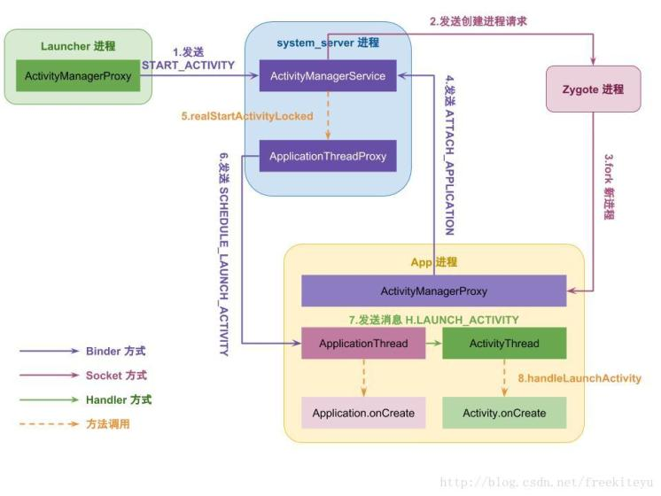
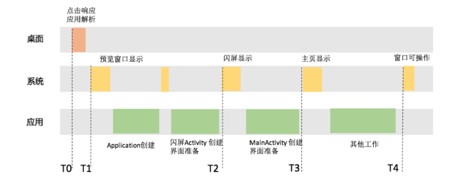
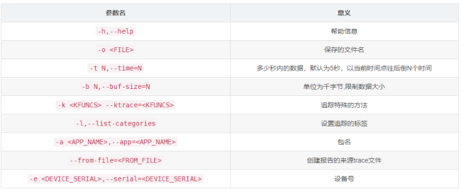
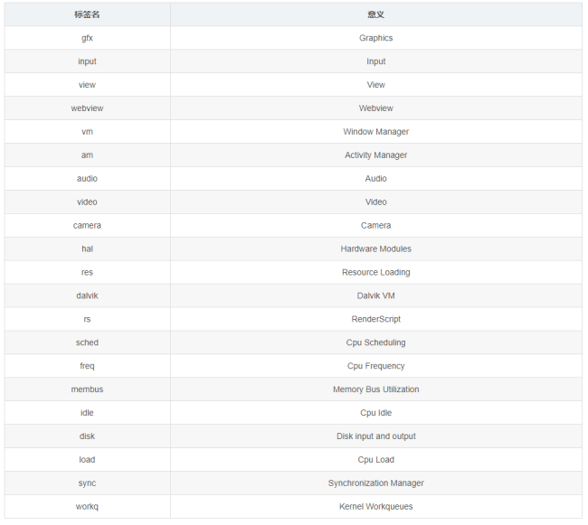
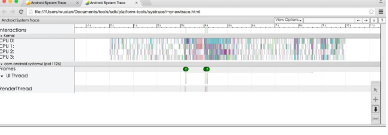
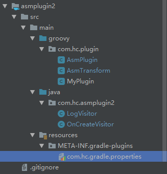

# 启动优化（上）
### 一、App 启动过程分析
##### 1、从用户点击图标到应用启动的过程


##### 2、启动过程分析

App 的启动可以分成三类： 冷启动、暖启动和热启动。
冷启动：后台没有进程或者服务，需要新建进程，用户通过点击 icon 来启动，耗时最长。


暖启动，可能有如下两种情况：
1、用户离开了 app ，进程虽然没被杀死，但是 Activity 都被回收了，需要新建。
2、App 被回收了，进程和Acitity 都需要重新启动，但是可以从 onCreate 保存的 bundle 中恢复。


热启动：后台进程没有被杀死，相当于点击 Home 之后又启动了应用程序。


白屏与闪屏页
白屏就是自己设置的 Theme 属性来决定的。闪屏页可以理解为广告页，一般都是带用 xx 秒跳过， 那个页面。


以微信为例，从用户点击图标开始，会经过四个关键阶段：

- **T1预览窗口显示**

系统在拉起微信进程之前，会先根据微信的 Theme 属性创建预览窗口。如果我们设置了禁用预览窗口或者将预览窗口指定为透明，则用户在这段时间看到的依然是桌面。


- **T2闪屏显示**

在微信进程和闪屏窗口页面创建完毕，并且完成一些列 inflate view,onmeasure,onlayout 之后，就会看到闪屏页，也就是小地球。


- **T3 主页显示**

在完成主窗口创建和页面显示的准备工作之后，用户可以看到微信的主界面。


- **T4 界面可操作**

在启动完成之后，还需要进行其他服务、插件等的加载，完成之后，才能真正的使用 App 的功能。


##### 3、启动问题分析
启动过程需要避免的问题：
1、设置为透明主题之后，点击图标很久不显示
低端机明显。


2、首页显示太慢
也就是 T3 这段时间，由于应用程序进行了太多的初始化操作，如热修复框架，闪屏广告，插件话框架等。


3、首页显示之后无法操作
通过异步操作把初始化放到了自线程，导致即使首页显示了，但是初始化没有成功，依然无法操作。


### 二、启动优化
##### 1、优化工具
通过 systrace + 函数插桩 来监控系统关键事件，如 GC,System Server，CPU 调度等。


通过插桩，可以看到应用主线程和其他线程函数调用流程。实现原理就是在函数的入口和出口插入统计函数。


```
class Trace {
  public static void i(String tag) {
    Trace.beginSection(name);
  }


  public static void o() {
      Trace.endSection();
  }
}
```


使用：


```
class Test {
  public void test() {
    Trace.i("Test.test()");
    //原来的工作
    Trace.o()；
  }
}
```


但是需要注意的是，不是所有的函数都统计，否则很耗性能。


##### 2、优化的方式
通过优化工具，得到启动的相关信息之后，可以得到这段时间系统、应用各个进程的运行情况。具体的优化可以分为闪屏优化、业务梳理、业务优化、线程优化、GC 优化 和 系统调用优化。

- 闪屏优化

推荐的做法是
1、在 6.0 或者 7.0 以上使用 “预览闪屏”方案。
2、可以尝试合并闪屏页和主页 Activity ，因为减少一个Acitity 可以减少 100ms 的优化，但是逻辑会很复杂。


- 业务梳理

梳理那些业务一定要初始化，那些可以砍掉。


- 业务优化

尝试优化逻辑，算法等，对必须加载的业务进行初始化优化。


- 线程优化

使用线程池，避免线程频繁切换，同时避免线程死锁，或者锁等待。


- GC 优化

频繁的 GC 一定会耗时，因此启动过程避免进行大量的字符串操作，序列化和反序列化，大对象的创建和回收等。


- 系统调度优化

启动过程尽量不要系统调用，如 PackageManagerService 操作、Binder 调用等，也不要过早的拉起其他进程，新进程会竞争 CPU 资源。
对于GC各个事件的具体含义，可以参考[《调查RAM使用情况》](http://developer.android.com/studio/profile/investigate-ram?hl=zh-cn)。

### 三、Systrace 工具的使用
官网地址：[https://developer.android.com/studio/profile/systrace?hl=zh-cn](https://developer.android.com/studio/profile/systrace?hl=zh-cn)
##### 1、什么是 Systrace
Systrace 是用于收集和检测设备在运行过程中的时序信息的一个脚本工具，它结合了来自Android内核的数据，例如CPU调度程序，磁盘活动和应用程序线程，最终会以HTML的形式报告。这个脚本文件在 /sdk/platform-tools/systrace/ 目录下。

##### 2、Systrace 的使用

- 需要安装 python

通过如下命令来收集数据：


```
python systrace.py --time=10 -o mynewtrace.html sched gfx view wm
```


其中，-time 为间隔时间，-o 为文件名。
更详细的参数信息如下：



可选标签：



执行上述命令，会生成 html 文件。



##### 3、systrace 的使用
查看 systrace 是，需要用到的快捷键。


### 四、ASM 插桩
参考资料：
[https://chsmy.github.io/2019/09/28/architecture/%E4%BD%BF%E7%94%A8ASM%E5%AE%8C%E6%88%90%E7%BC%96%E8%AF%91%E6%97%B6%E6%8F%92%E6%A1%A9/](https://chsmy.github.io/2019/09/28/architecture/%E4%BD%BF%E7%94%A8ASM%E5%AE%8C%E6%88%90%E7%BC%96%E8%AF%91%E6%97%B6%E6%8F%92%E6%A1%A9/)


[https://juejin.im/post/5c6eaa066fb9a049fc042048](https://juejin.im/post/5c6eaa066fb9a049fc042048)
[https://www.ctolib.com/zhengcx-MethodTraceMan.html](https://www.ctolib.com/zhengcx-MethodTraceMan.html)


[https://juejin.im/entry/58be2619128fe1006452c8c3](https://juejin.im/entry/58be2619128fe1006452c8c3)


[https://blog.csdn.net/huachao1001/article/details/51819972](https://blog.csdn.net/huachao1001/article/details/51819972)


#### 1、什么是 ASM

- ASM 是一个 Java 字节码操作和分析框架，可以用来动态的生成类。
- ASM 可以直接产生二进制的 class 文件，也可以在类被加载到 JAVA 虚拟机之前改变类的行为。
- Java Class 的类文件的信息存储在 .class 文件，ASM 可以读取 .class 文件中的类信息，改变类行为，分析类信息，甚至生成新的类。


Android  java 文件打包流程：
.java -> .class -> .dex.


因此，如果想完成编译时插桩，一般有两种方式：
更改 java 文件： APT ，AndroidAnnotation 都是这个层面的技术，dagger 和 butterknife 就这方面的应用。


更改 class 文件 ： AspectJ,ASM，javassisit 等。


#### 2、ASM 实践 统计Application 的执行时间
##### 第一步  拿到 class 文件
Google 提供了  Transfrom API ,通过这个 API 我们可以在打包成 dex 文件之前，拿到 class 文件，并对 class 文件进行操作。


- 新建一个项目，然后新建一个 module 来编写 asm gradle 插件
- 在 main 下新建一个 groovy 文件夹存放 groovy 文件。
- 在 main 下新建 resource/MATE-INFE 文件夹，然后再里面新建一个 properties 文件，主要是为了告诉 gradle 我们使用的插件是哪个。这个名字可以随便区，但是后面使用的时候，要用这个名字。


目录结构如下：



接着到修改当前 module 的 gradle 文件，添加依赖，并且添加打包配置选项，这里直接打包到本地就行。
```
apply plugin: 'groovy'
apply plugin: 'maven'

dependencies {


    //gradle sdk
    compile gradleApi()
    //groovy sdk
    compile localGroovy()


    //gradle sdk
    implementation gradleApi()
    //groovy sdk
    implementation localGroovy()

    implementation 'com.android.tools.build:gradle:3.5.0'
    //ASM相关依赖
    implementation 'org.ow2.asm:asm:7.1'
    implementation 'org.ow2.asm:asm-commons:7.1'


}

repositories {
    maven { url 'https://maven.aliyun.com/repository/public/' }
    mavenCentral()
    jcenter()
}

//group和version在后面使用自定义插件的时候会用到
group='com.hc.plugin'
version='1.0.4'//

uploadArchives {
    repositories {
        mavenDeployer {
            //提交到远程服务器：
            // repository(url: "http://www.xxx.com/repos") {
            //    authentication(userName: "admin", password: "admin")
            // }
            //本地的Maven地址设置为D:/repos
            repository(url: uri('D:/repos'))
        }
    }
}
```


接下来新建一个 groovy  文件来写插件。
```
package com.hsm.asmplugin

import com.android.build.gradle.AppExtension
import org.gradle.api.Plugin
import org.gradle.api.Project
import org.jetbrains.annotations.NotNull
public class AsmPlugin implements Plugin<Project> {

    @Override
    public void apply(@NotNull Project project) {
        def android = project.extensions.getByType(AppExtension)
        println '----------- 开始注册 >>>>> -----------'
        AsmTransform transform = new AsmTransform()
        android.registerTransform(transform)
    }
}
```


上面的代码主要有两个作用：
1、获取 AppExtension 类型的 extension 。
2、把我们自己定义的 Transform 注册进去。


自定义 AsmTransfrom 如下：
```
package com.hsm.asmplugin

import com.android.build.api.transform.*
import com.android.build.gradle.internal.pipeline.TransformManager
import com.chs.asm.LogVisitor
import org.apache.commons.codec.digest.DigestUtils
import org.apache.commons.io.FileUtils
import org.apache.commons.io.IOUtils
import org.objectweb.asm.ClassReader
import org.objectweb.asm.ClassVisitor
import org.objectweb.asm.ClassWriter

import java.util.jar.JarEntry
import java.util.jar.JarFile
import java.util.jar.JarOutputStream
import java.util.zip.ZipEntry

public class AsmTransform extends Transform {

    // 设置我们自定义的Transform对应的Task名称
    // 编译的时候可以在控制台看到 比如：Task :app:transformClassesWithAsmTransformForDebug
    @Override
    public String getName() {
        return "AsmTransform"
    }
    // 指定输入的类型，通过这里的设定，可以指定我们要处理的文件类型
    // 这样确保其他类型的文件不会传入
    @Override
    public Set<QualifiedContent.ContentType> getInputTypes() {
        return TransformManager.CONTENT_CLASS;
    }
    // 指定Transform的作用范围
    @Override
    public Set<? super QualifiedContent.Scope> getScopes() {
        return TransformManager.SCOPE_FULL_PROJECT
    }

    @Override
    public boolean isIncremental() {
        return false
    }

    @Override
    public void transform(TransformInvocation transformInvocation) throws TransformException, InterruptedException, IOException {
        long startTime = System.currentTimeMillis()
        println '----------- startTime <' + startTime + '> -----------'
        //拿到所有的class文件
        Collection<TransformInput> inputs = transformInvocation.inputs;
        TransformOutputProvider outputProvider = transformInvocation.outputProvider;
        if (outputProvider != null) {
            outputProvider.deleteAll()
        }
        //遍历inputs Transform的inputs有两种类型，一种是目录，一种是jar包，要分开遍历
        inputs.each { TransformInput input ->
            //遍历directoryInputs(文件夹中的class文件) directoryInputs代表着以源码方式参与项目编译的所有目录结构及其目录下的源码文件
            // 比如我们手写的类以及R.class、BuildConfig.class以及R$XXX.class等
            input.directoryInputs.each { DirectoryInput directoryInput ->
                //文件夹中的class文件
                handDirectoryInput(directoryInput, outputProvider)
            }
            //遍历jar包中的class文件 jarInputs代表以jar包方式参与项目编译的所有本地jar包或远程jar包
            input.jarInputs.each { JarInput jarInput ->
                //处理jar包中的class文件
                handJarInput(jarInput, outputProvider)
            }
        }
    }

    //遍历directoryInputs  得到对应的class  交给ASM处理
    private static void handDirectoryInput(DirectoryInput input, TransformOutputProvider outputProvider) {
        //是否是文件夹
        if (input.file.isDirectory()) {
            //列出目录所有文件（包含子文件夹，子文件夹内文件）
            input.file.eachFileRecurse { File file ->
                String name = file.name
                //需要插桩class 根据自己的需求来------------- 这里判断是否是我们自己写的Application
                if ("MyApp.class".equals(name)) {
                    ClassReader classReader = new ClassReader(file.bytes)
                    //传入COMPUTE_MAXS  ASM会自动计算本地变量表和操作数栈
                    ClassWriter classWriter = new ClassWriter(classReader, ClassWriter.COMPUTE_MAXS)
                    //创建类访问器   并交给它去处理
                    ClassVisitor classVisitor = new LogVisitor(classWriter)
                    classReader.accept(classVisitor, ClassReader.EXPAND_FRAMES)
                    byte[] code = classWriter.toByteArray()
                    FileOutputStream fos = new FileOutputStream(file.parentFile.absolutePath + File.separator + name)
                    fos.write(code)
                    fos.close()
                }
            }
        }
        //处理完输入文件后把输出传给下一个文件
        def dest = outputProvider.getContentLocation(input.name, input.contentTypes, input.scopes, Format.DIRECTORY)
        FileUtils.copyDirectory(input.file, dest)
    }
    //遍历jarInputs 得到对应的class 交给ASM处理
    private static void handJarInput(JarInput jarInput, TransformOutputProvider outputProvider) {
        if (jarInput.file.getAbsolutePath().endsWith(".jar")) {
            //重名名输出文件,因为可能同名,会覆盖
            def jarName = jarInput.name
            def md5Name = DigestUtils.md5Hex(jarInput.file.getAbsolutePath())
            if (jarName.endsWith(".jar")) {
                jarName = jarName.substring(0, jarName.length() - 4)
            }
            JarFile jarFile = new JarFile(jarInput.file)
            Enumeration enumeration = jarFile.entries()
            File tmpFile = new File(jarInput.file.getParent() + File.separator + "classes_temp.jar")
            //避免上次的缓存被重复插入
            if (tmpFile.exists()) {
                tmpFile.delete()
            }
            JarOutputStream jarOutputStream = new JarOutputStream(new FileOutputStream(tmpFile))
            //用于保存
            while (enumeration.hasMoreElements()) {
                JarEntry jarEntry = (JarEntry) enumeration.nextElement()
                String entryName = jarEntry.getName()
                ZipEntry zipEntry = new ZipEntry(entryName)
                InputStream inputStream = jarFile.getInputStream(jarEntry)
                //需要插桩class 根据自己的需求来-------------
                if ("androidx/fragment/app/FragmentActivity.class".equals(entryName)) {
                    //class文件处理
                    println '----------- jar class  <' + entryName + '> -----------'
                    jarOutputStream.putNextEntry(zipEntry)
                    ClassReader classReader = new ClassReader(IOUtils.toByteArray(inputStream))
                    ClassWriter classWriter = new ClassWriter(classReader, ClassWriter.COMPUTE_MAXS)
                    //创建类访问器   并交给它去处理
                    ClassVisitor cv = new LogVisitor(classWriter)
                    classReader.accept(cv, ClassReader.EXPAND_FRAMES)
                    byte[] code = classWriter.toByteArray()
                    jarOutputStream.write(code)
                } else {
                    jarOutputStream.putNextEntry(zipEntry)
                    jarOutputStream.write(IOUtils.toByteArray(inputStream))
                }
                jarOutputStream.closeEntry()
            }
            //结束
            jarOutputStream.close()
            jarFile.close()
            //获取output目录
            def dest = outputProvider.getContentLocation(jarName + md5Name,
                    jarInput.contentTypes, jarInput.scopes, Format.JAR)
            FileUtils.copyFile(tmpFile, dest)
            tmpFile.delete()
        }
    }
}
```


ASM 中使用的核心类有：

- ClassReader  用来解析编译过的字节码文件
- ClassWriter 用来重新构建编译后的类，比如修改类名，属性，方法或者生成新类的字节码文件
- ClassVisitor 用来访问类成员信息，包括标记在类上的注解，类的构造方法，类的字段，方法，静态代码快等。
- AdviceAdapter 用来访问方法的信息，用来进行具体方法字节码操作，是 MethodVisitor 的增强实现。


##### 第二步 动态插入代码
先遍历所有 class 文件，然后找到我们想要处理定 clas ，交给自定义类访问器来处理。
```
package com.chs.asm;

import org.objectweb.asm.ClassVisitor;
import org.objectweb.asm.MethodVisitor;
import org.objectweb.asm.Opcodes;

public class LogVisitor extends ClassVisitor {
    private String mClassName;
    public LogVisitor(ClassVisitor classVisitor) {
        super(Opcodes.ASM5, classVisitor);
    }

    @Override
    public void visit(int version, int access, String name, String signature, String superName, String[] interfaces) {
        System.out.println("LogVisitor : visit -----> started:" + name);
        this.mClassName = name;
        super.visit(version, access, name, signature, superName, interfaces);
    }
    //定义一个方法， 返回的MethodVisitor用于生成方法相关的信息
    @Override
    public MethodVisitor visitMethod(int access, String name, String desc, String signature, String[] exceptions) {
        MethodVisitor mv = cv.visitMethod(access, name, desc, signature, exceptions);
        if ("com/hsm/asmtext/MyApp".equals(this.mClassName)) {
            if ("onCreate".equals(name)) {
                //处理onCreate
                System.out.println("LogVisitor : visitMethod method ----> " + name);
                return new OnCreateVisitor(mv);
            }
        }
        return mv;
    }
    //访问结束
    @Override
    public void visitEnd() {
        System.out.println("LogVisitor : visit -----> end");
        super.visitEnd();
    }
}
```


类访问器对 onCreate 进行处理.
```
package com.chs.asm;

import org.objectweb.asm.Label;
import org.objectweb.asm.MethodVisitor;
import org.objectweb.asm.Opcodes;


public class OnCreateVisitor extends MethodVisitor {

    public OnCreateVisitor(MethodVisitor methodVisitor) {
        super(Opcodes.ASM5, methodVisitor);
    }
    //开始访问方法
    @Override
    public void visitCode() {
        super.visitCode();

        mv.visitMethodInsn(Opcodes.INVOKESTATIC, "java/lang/System", "currentTimeMillis", "()J", false);
        mv.visitVarInsn(Opcodes.LSTORE, 1);
    }

    @Override
    public void visitInsn(int opcode) {
        //判断内部操作指令
        //当前指令是RETURN，表示方法内部的代码已经执行完
        if (opcode == Opcodes.RETURN) {
            mv.visitMethodInsn(Opcodes.INVOKESTATIC, "java/lang/System", "currentTimeMillis", "()J", false);
            mv.visitVarInsn(Opcodes.LLOAD, 1);
            mv.visitInsn(Opcodes.LSUB);
            mv.visitVarInsn(Opcodes.LSTORE, 3);
            Label l3 = new Label();
            mv.visitLabel(l3);
            mv.visitLineNumber(20, l3);
            mv.visitLdcInsn("TAG");
            mv.visitTypeInsn(Opcodes.NEW, "java/lang/StringBuilder");
            mv.visitInsn(Opcodes.DUP);
            mv.visitMethodInsn(Opcodes.INVOKESPECIAL, "java/lang/StringBuilder", "<init>", "()V", false);
            mv.visitLdcInsn("interval:");
            mv.visitMethodInsn(Opcodes.INVOKEVIRTUAL, "java/lang/StringBuilder", "append", "(Ljava/lang/String;)Ljava/lang/StringBuilder;", false);
            mv.visitVarInsn(Opcodes.LLOAD, 3);
            mv.visitMethodInsn(Opcodes.INVOKEVIRTUAL, "java/lang/StringBuilder", "append", "(J)Ljava/lang/StringBuilder;", false);
            mv.visitMethodInsn(Opcodes.INVOKEVIRTUAL, "java/lang/StringBuilder", "toString", "()Ljava/lang/String;", false);
            mv.visitMethodInsn(Opcodes.INVOKESTATIC, "android/util/Log", "i", "(Ljava/lang/String;Ljava/lang/String;)I", false);
            mv.visitInsn(Opcodes.POP);
        }
        super.visitInsn(opcode);
    }

    @Override
    public void visitEnd() {
        super.visitEnd();
        //访问结束
    }
}
```


最后上传 jar 包，引入插件查看效果。
### 四、课后练习
demo 地址：
[https://github.com/AndroidAdvanceWithGeektime/Chapter07](https://github.com/AndroidAdvanceWithGeektime/Chapter07)
Systrace 相关：
[https://www.cnblogs.com/blogs-of-lxl/p/10926824.html](https://www.cnblogs.com/blogs-of-lxl/p/10926824.html)


这个Sample是学习如何给代码加入Trace Tag, 大家可以将这个代码运用到自己的项目中，然后利用systrace查看结果
结果如下：
```
    protected void onResume() {
        TraceTag.i("com.sample.systrace.MainActivity.onResume.()V");
        super.onResume();
        Log.i("MainActivity", "[onResume]");
        TraceTag.o();
    }
```

#### 操作步骤
操作步骤如下：

1. 使用Android Studio打开工程Chapter07
2. 运行gradle task ":systrace-gradle-plugin:buildAndPublishToLocalMaven" 编译plugin插件
3. 使用Android Studio单独打开工程systrace-sample-android
4. 编译app

#### 注意事项
在systrace-sample-android工程中，需要注意以下几点：

1. 插桩代码会自动过滤短函数，过滤结果输出到`Chapter07/systrace-sample-android/app/build/systrace_output/Debug.ignoremethodmap`。
2. 我们也可以单独控制不插桩的白名单，配置文件位于`Chapter07/systrace-sample-android/app/blacklist/blackMethodList.txt`， 可以指定class或者包名。
3. 插桩后的class文件在目录`Chapter07/systrace-sample-android/app/build/systrace_output/classes`中查看。

然后运行应用，需要打开systrace
```
python $ANDROID_HOME/platform-tools/systrace/systrace.py gfx view wm am pm ss dalvik app sched -b 90960 -a com.sample.systrace  -o test.log.html
```